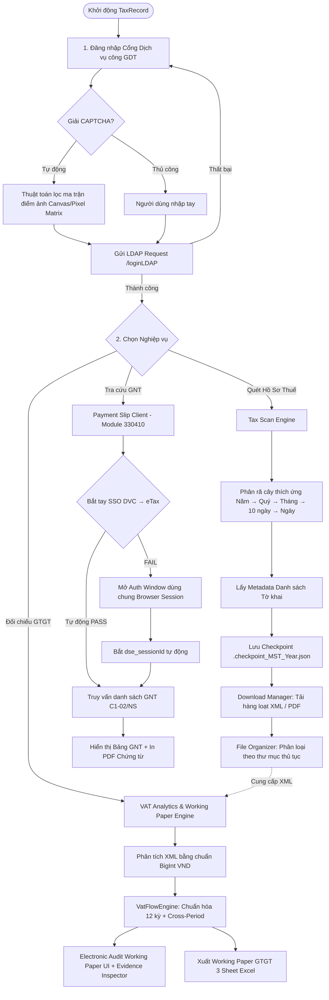
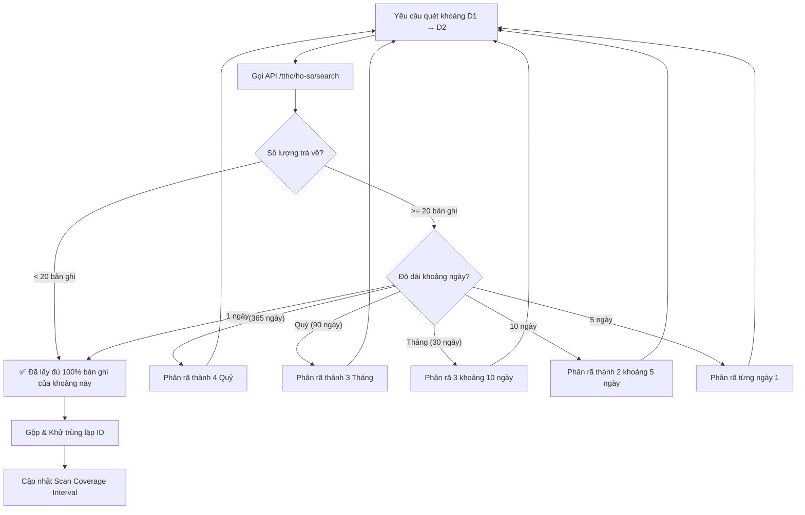

# BÁO CÁO TOÀN DIỆN KIẾN TRÚC, MODULE & SƠ ĐỒ HOẠT ĐỘNG DỰ ÁN TAXRECORD
**Phiên bản:** 2.0.0 — Release Candidate / Conditional GO  
**Ngày cập nhật:** 18/08/2026  
**Nền tảng:** Electron + React + TypeScript + Vite + TailwindCSS  

---

## 1. BẢNG TRẠNG THÁI RELEASE GATES (CONDITIONAL GO)

| Phân hệ / Tiêu chí | Trạng thái kỹ thuật | Trạng thái Verification | Ghi chú & Điều kiện Release |
| :--- | :---: | :---: | :--- |
| **1. Portal & Auth Engine** | `IMPLEMENTED` | **PASS** | Đăng nhập LDAP Cổng DVC, giải CAPTCHA tự động bằng thuật toán ma trận điểm ảnh (Pixel Matrix Filter). |
| **2. Quét & Phân rã Thích ứng** | `IMPLEMENTED` | **PASS\*** | Phân rã cây đệ quy (Năm → Quý → Tháng → 10 ngày → Ngày). *Cần torture test case >20 hồ sơ/10 ngày.* |
| **3. VAT Working Paper Engine** | `IMPLEMENTED` | **PASS\*** | Single Source of Truth (`VatFlowEngine.ts`), số học `BigInt` VND. *Cần test parity đọc ngược file Excel.* |
| **4. Version Chain & Cross-Period** | `IMPLEMENTED` | **PASS\*** | Chuỗi BS1 → BS2, ánh xạ `[37]` / `[38]`, bảo toàn chuỗi khi thiếu bản trước. *Cần golden dataset verification.* |
| **5. Data Coverage Engine** | `IMPLEMENTED` | **PASS\*** | Phân tách Kỳ kê khai vs. Ngày nộp, merge/dedupe dải ngày thiếu, rebuild chain sau scan. *Cần persistence test.* |
| **6. Downloader & Storage** | `IMPLEMENTED` | **PASS** | Hàng đợi tải song song, an toàn Zip Slip, lưu trữ tự động theo mã thủ tục. |
| **7. Giấy Nộp Tiền (eTax 330410)** | `IMPLEMENTED` | **BLOCKED / PARTIAL** | 7 Checkpoints diagnostics, hỗ trợ Auth Window Fallback. *Đang xác định checkpoint fail thực tế trên live flow.* |
| **8. Security by Design** | `IMPLEMENTED` | **PASS\*** | Context Isolation, Redact token/mật khẩu trong Audit Log. *Cần final security audit.* |
| **9. Đóng gói Windows EXE** | `IMPLEMENTED` | **BUILD VERIFIED** | NSIS Installer & Portable EXE build Exit Code 0. |
| **10. Clean-machine Runtime** | `PENDING` | **NOT VERIFIED** | Cần kiểm thử runtime trên môi trường Windows sạch trước khi thương mại hóa. |

```text
──────────────────────────────────────────────────────────────────
TỔNG KẾT RELEASE GATE:  COMMERCIAL RELEASE = NO-GO (Conditional GO)
──────────────────────────────────────────────────────────────────
→ Dự án đã hoàn thiện kiến trúc và đóng băng tính năng mới (Feature Freeze).
→ Chuyển toàn bộ trọng tâm sang Live Verification + Automated Evidence Tests.
```

---

## 2. SƠ ĐỒ HOẠT ĐỘNG HỆ THỐNG

### 2.1. Sơ Đồ Luồng Tổng Thể (End-to-End Workflow)



---

### 2.2. Sơ Đồ Quét Phân Rã Thích Ứng Mở Rộng Đa Cấp
*Bảo đảm thu thập 100% hồ sơ không bị tràn giới hạn 20 bản ghi/trang của GDT:*



---

### 2.3. Sơ Đồ Single Source of Truth VAT (UI ↔ Excel Parity)

```mermaid
flowchart LR
    subgraph Input_Data ["Dữ liệu đầu vào"]
        XMLFiles["XML Tờ khai 01/GTGT (TT80, TT26, TT156)"]
        MetaList["Metadata Hồ sơ Cổng DVC"]
    end

    subgraph Parsing_Layer ["VatAnalyticsEngine (Main Process)"]
        BigIntCalc["Phân tích chỉ tiêu [22]..[43] bằng BigInt VND"]
        SnapGroup["Gom nhóm theo kỳ kê khai (VatPeriodGroup)"]
    end

    subgraph Shared_Domain ["Shared Domain: VatFlowEngine"]
        ChainBuilder["Xây chuỗi phiên bản: Chính thức → BS1 → BS2"]
        CrossCheck["Phát hiện điều chỉnh kỳ cũ ảnh hưởng kỳ mới qua [37]/[38]"]
        FlowContinuity["Kiểm tra liên tục: [43] kỳ trước == [22] kỳ sau"]
        NormalizedModel["Normalized Year Flow Model"]
    end

    subgraph Output_Presentation ["Kết xuất đồng nhất 100%"]
        WorkingPaperUI["UI Working Paper 12 Tháng dọc"]
        EvidenceInsp["Evidence Inspector (Single Target)"]
        ExcelOutput["File Excel 3 Sheet (Working Paper + Lịch sử BS + Đ/c xuyên kỳ)"]
    end

    Input_Data --> Parsing_Layer
    Parsing_Layer --> Shared_Domain
    Shared_Domain --> Output_Presentation
```



---

## 3. DANH MỤC BACKLOG TRỌNG TÂM TRƯỚC KHI THƯƠNG MẠI HÓA

1. **P0 — GNT Live Verification**:
   - Chạy live trace với tài khoản thực tế.
   - Xác định chính xác checkpoint fail trong 7 bước (`GNT_01` → `GNT_07`).
   - Kiểm chứng query GNT thật, mở chi tiết thật và in PDF chứng từ thật.
2. **P1 — Adaptive Scan Torture Test**:
   - Thử nghiệm đệ quy phân rã với mật độ 20, 50, 100 records/tháng và >20 records/10 ngày.
   - Kiểm chứng: Zero missing + Zero duplicate.
3. **P1 — VAT Golden Dataset & Automated Parity Test**:
   - Xây dựng dataset bao gồm: *Chính thức → BS1 → BS2*, *Thiếu BS1*, *BS nộp năm sau*, *[37]/[38]*, *Lệch dòng chuyển kỳ*, *Hoàn thuế*.
   - Đọc ngược file `.xlsx` đã xuất để so sánh đối chiếu từng đồng VND với `TaxPeriodFlow`.
4. **P1 — Data Coverage Persistence Test**:
   - Kiểm chứng lưu trữ và phục hồi phạm vi quét khi restart app, đổi MST, quét đè hoặc hủy quét giữa chừng.
5. **P1 — Clean-Machine EXE Smoke Test**:
   - Kiểm thử cài đặt và vận hành trên môi trường Windows sạch (chưa cài Node/Dev tools).
6. **P2 — Security Audit**:
   - Kiểm tra IPC schema allowlist, path traversal, Zip Slip và secret redaction.
