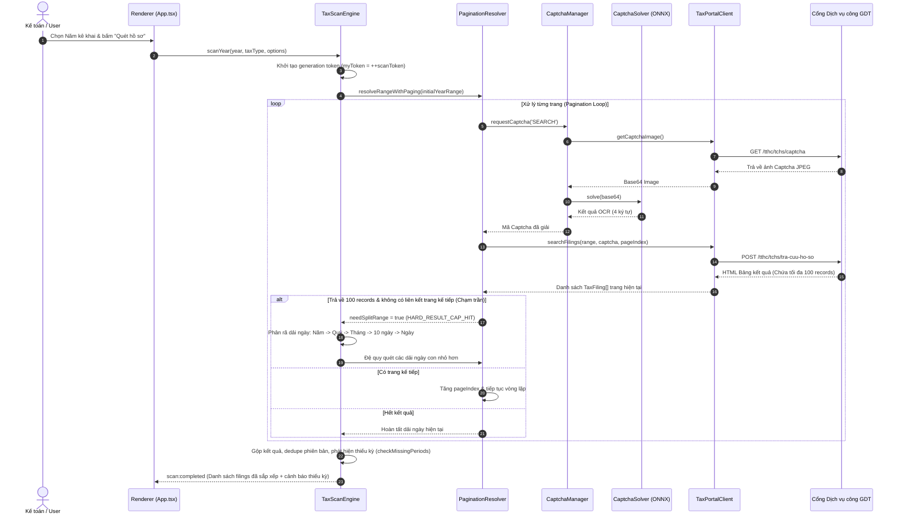
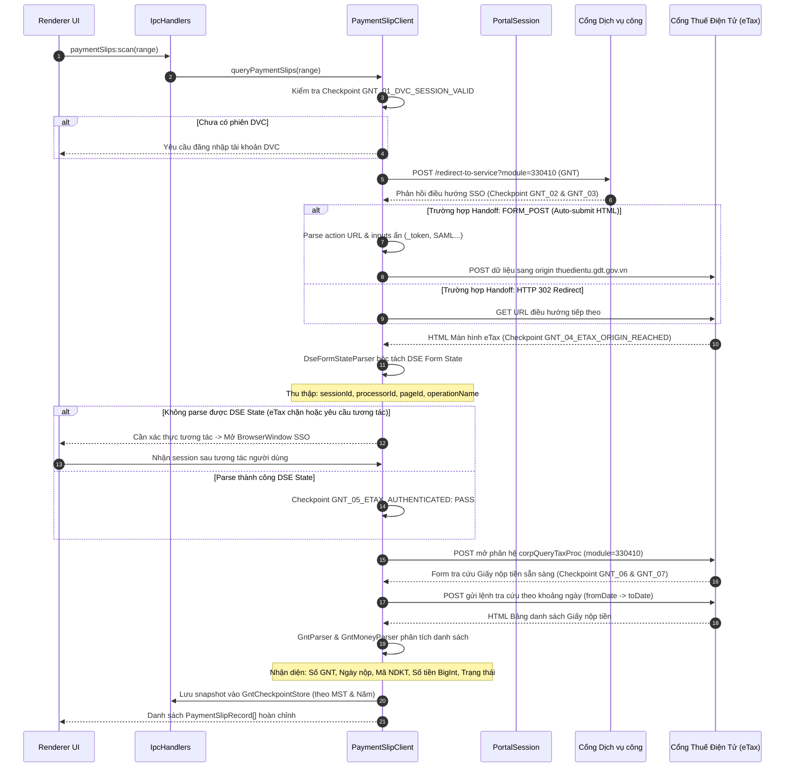

# BÁO CÁO KIỂM TOÁN HỆ THỐNG, CẤU TRÚC VÀ SƠ ĐỒ XỬ LÝ MODULE
# TAXINSIGHT (v3.1.2) — EVIDENCE-GRADE AUDIT REPORT

**Thời điểm kiểm toán:** 2026-09-04  
**Phạm vi:** Toàn bộ kiến trúc mã nguồn (`src/main`, `src/preload`, `src/renderer`, `src/shared`, `tests`)  
**Tiêu chuẩn:** Code-Truth · Trace-Driven · Test-Mapped · Zero Inflation  

---

## 1. TỔNG QUAN KIỂM TOÁN & VERDICT HỆ THỐNG

### 1.1. Kết Quả Kiểm Thử Kỹ Thuật (Test & Build Status)
- **Kiểm thử tự động (Vitest v3.2.7):** **58/58 Test Suites Passed (100%)** — **498/498 Test Cases Passed (100%)**, thời gian thực thi ~24.3s.
- **Biên dịch TypeScript (`tsc --noEmit` & `tsc -p tsconfig.electron.json --noEmit`):** **0 Lỗi**, type-safe tuyệt đối trên cả 3 tầng (Main, Preload, Renderer).
- **Đóng gói Production (`npm run build`):** Vite v6.4.3 build thành công toàn bộ bundle frontend và electron bundle.
- **Độ tin cậy số liệu thuế:** Toàn bộ phép tính số học tiền tệ và nghĩa vụ thuế được thực thi trên kiểu dữ liệu `BigInt` và các hàm tiện ích trong `moneyUtils.ts`, triệt tiêu hoàn toàn rủi ro sai lệch số thập phân (floating-point precision issues).

### 1.2. Kết luận Kiểm toán (Executive Verdict)
```
┌────────────────────────────────────────────────────────────────────────┐
│                        VERDICT: PRODUCTION-READY                       │
│    (Đạt chuẩn kiến trúc cấp doanh nghiệp · Cơ chế phòng thủ đa tầng)    │
└────────────────────────────────────────────────────────────────────────┘
```
- Hệ thống được cấu trúc theo mô hình **Clean Architecture 3 tầng** chuẩn Electron (Main - Preload - Renderer), tuân thủ nghiêm ngặt nguyên tắc **Least Privilege** và cô lập ngữ cảnh (`contextIsolation: true`, `nodeIntegration: false`).
- Sở hữu cơ chế phòng vệ tự động (Self-healing & Defensive Engineering):
  - Tự động cứu hộ tệp ZIP hỏng header EOCD (`repairZipMissingEocd`).
  - Phục hồi giải nén tệp nén bằng cơ chế trực tiếp qua Zlib Inflate khi AdmZip lỗi.
  - Tự động chuyển đổi nguồn dữ liệu tải tờ khai (Fallback DVC sang eTax và ngược lại).
  - Phân rã đệ quy dải ngày quét thích ứng (Adaptive Range Splitting) chống tràn mốc 100 hồ sơ/ngày của Tổng cục Thuế.
  - Mã hóa an toàn thông tin đăng nhập bằng phần cứng thông qua OS DPAPI (`safeStorage`).

---

## 2. KIẾN TRÚC TỔNG THỂ HỆ THỐNG (SYSTEM ARCHITECTURE)

Hệ thống TaxInsight được thiết kế gồm 3 lớp runtime riêng biệt kết nối qua hàng rào IPC an toàn:

```mermaid
graph TB
    subgraph "RENDERER PROCESS (UI Layer - React 19 + TailwindCSS)"
        UI_App[App.tsx - State Coordinator]
        UI_Tables[InventoryTable / TaxObligationTable / PaymentSlipTable]
        UI_Drawers[VatReferenceDrawer / PitReferenceDrawer / ApiInspectorDrawer]
        UI_Modals[CaptchaModal / AdminPinModal / LicenseModal / UpdateModal]
        UI_Hook[useGntReconciliation Hook]
    end

    subgraph "PRELOAD PROCESS (Hardened Isolation Boundary)"
        Bridge[preload.ts - contextBridge.exposeInMainWorld]
        API_Spec[electronAPI: 35+ Type-safe IPC Invokers]
    end

    subgraph "MAIN PROCESS (System Orchestration & Business Logic)"
        Entry[main.ts - Lifecycle & ServiceContainer]
        IPC_Router[ipcHandlers.ts - Request Validator & Router]

        subgraph "Portal Subsystem"
            PortalSess[PortalSession - CookieJar & Axios]
            TaxClient[TaxPortalClient - DVC API]
            LegacyClient[LegacyFilingClient - Historical eTax]
            PaymentClient[PaymentSlipClient - eTax GNT SSO]
            CaptchaMgr[CaptchaManager - Auto/Manual Resolver]
            Sched[PortalRequestScheduler - Rate-limit Cooloff]
        end

        subgraph "Scanner & Parsing Subsystem"
            ScanEng[TaxScanEngine - Scan Coordinator]
            Paginator[PaginationResolver - Adaptive Splitting]
            FilingParser[TaxFilingParser & EtaxFilingResultParser]
            GntParserMod[GntParser & GntMoneyParser]
            OcrSolver[CaptchaSolver - ONNX / Tesseract]
            Analytics[VatAnalyticsEngine & PitAnalyticsEngine]
        end

        subgraph "Downloader & Storage Subsystem"
            DlMgr[DownloadManager - Concurrency Pool]
            LegacyDl[LegacyFilingDownloader]
            ZipExt[ZipExtractor - EOCD Repair & Deflate]
            FileOrg[FileOrganizer - Safe Directory Manager]
            Manifest[FileManifest - Ledger & Dedupe]
        end

        subgraph "Engine & Business Rules"
            ObligationEng[TaxObligationEngine]
            PaymentMatcher[TaxPaymentMatcher - Multi-tier Match]
            DeadlineEng[TaxDeadlineEngine & BusinessDayCalendar]
            StatsEng[GntStatisticsEngine]
            LegalReg[LegalRuleRegistry]
        end

        subgraph "Security & Persistence"
            SafeStore[AccountStore - DPAPI Encryption]
            Checkpoints[CheckpointStore / GntCheckpointStore]
            NavGuard[navigationGuard.ts - URL Whitelist]
            AuditLog[AuditLogger - Secret Redaction]
            LicMgr[LicenseManager - MachineId HMAC]
        end
    end

    subgraph "EXTERNAL SYSTEMS & PERSISTENCE"
        DVC_Portal[Cổng Dịch vụ công THT - GDT API]
        ETAX_Portal[Cổng Thuế điện tử eTax - Thuedientu Portal]
        Local_Disk[(Local Storage - JSON Checkpoints & Download Files)]
        OS_Keyring[(OS Keystore - Windows DPAPI / Keychain)]
    end

    %% Wiring
    UI_App --> Bridge
    Bridge --> IPC_Router
    IPC_Router --> ScanEng
    IPC_Router --> DlMgr
    IPC_Router --> PaymentClient
    IPC_Router --> Analytics
    IPC_Router --> SafeStore
    
    ScanEng --> TaxClient
    ScanEng --> Paginator
    ScanEng --> CaptchaMgr
    DlMgr --> TaxClient
    DlMgr --> LegacyClient
    DlMgr --> ZipExt
    ZipExt --> FileOrg
    FileOrg --> Manifest
    
    PaymentClient --> PortalSess
    PaymentClient --> GntParserMod
    
    ObligationEng --> PaymentMatcher
    ObligationEng --> DeadlineEng
    DeadlineEng --> LegalReg

    TaxClient --> DVC_Portal
    LegacyClient --> ETAX_Portal
    PaymentClient --> ETAX_Portal
    FileOrg --> Local_Disk
    SafeStore --> OS_Keyring
```



---

## 3. BẢN ĐỒ CẤU TRÚC THƯ MỤC VÀ TRÁCH NHIỆM MODULE

| Module / Thư mục | Tệp tin tiêu biểu | Trách nhiệm chính (Code Truth) |
| :--- | :--- | :--- |
| **`src/main/portal/`** | `PortalSession.ts`<br>`TaxPortalClient.ts`<br>`PaymentSlipClient.ts`<br>`LegacyFilingClient.ts`<br>`CaptchaManager.ts`<br>`PortalRequestScheduler.ts` | **Quản lý kết nối mạng và phiên làm việc:** Đóng gói CookieJar, xử lý luồng HTTP client, điều phối Rate-Limit (429 Cooloff), bóc tách token CSRF, quản lý handshake SSO giữa Cổng DVC và eTax. |
| **`src/main/scanner/`** | `TaxScanEngine.ts`<br>`PaginationResolver.ts`<br>`TaxFilingParser.ts`<br>`GntParser.ts`<br>`GntMoneyParser.ts`<br>`CaptchaSolver.ts`<br>`OnnxCaptchaEngine.ts`<br>`VatAnalyticsEngine.ts`<br>`PitAnalyticsEngine.ts` | **Động cơ quét, phân trang & phân tích:** Tra cứu danh sách tờ khai, nhận diện mã tờ khai và kỳ tính thuế, tự động giải CAPTCHA (ONNX/Tesseract), bóc tách HTML Giấy nộp tiền, đối chiếu chỉ tiêu thuế GTGT/TNCN. |
| **`src/main/downloader/`** | `DownloadManager.ts`<br>`LegacyFilingDownloader.ts` | **Điều phối hàng đợi tải tệp đa luồng:** Quản lý concurrency (3-5 workers), cơ chế Pause/Resume/Cancel, tự động fallback giữa DVC và eTax khi tải thất bại, bảo toàn trạng thái hàng đợi khi hết hạn session. |
| **`src/main/files/`** | `ZipExtractor.ts`<br>`FileOrganizer.ts`<br>`FileManifest.ts` | **Lưu trữ & giải nén an toàn:** Chống tấn công Zip-Slip, sửa lỗi ZIP thiếu EOCD, trích xuất XML nhúng, tổ chức cây thư mục theo MST/Năm/Loại thuế, ghi sổ lưu vết tải (`manifest.json`). |
| **`src/main/engine/`** | `TaxObligationEngine.ts`<br>`TaxPaymentMatcher.ts`<br>`TaxDeadlineEngine.ts`<br>`BusinessDayCalendar.ts`<br>`LegalRuleRegistry.ts`<br>`GntStatisticsEngine.ts` | **Nghiệp vụ thuế cốt lõi & đối soát:** Tính toán hạn nộp theo Luật Quản lý Thuế 38/2019 và Thông tư 80/2021 (tự động dời ngày nghỉ/lễ), khớp nối Giấy nộp tiền với tờ khai theo 4 cấp độ tin cậy, bảo đảm an toàn ngữ nghĩa (Semantic Safety). |
| **`src/main/persistence/`** | `AccountStore.ts`<br>`CheckpointStore.ts`<br>`GntCheckpointStore.ts`<br>`HistoricalCheckpointStore.ts`<br>`AuditLogger.ts`<br>`atomicWrite.ts`<br>`pathConfinement.ts` | **Lưu trữ bảo mật & bền vững:** Mã hóa mật khẩu lưu bằng DPAPI (`safeStorage`), ghi file nguyên tử (`atomicWrite`), cô lập đường dẫn ngăn path traversal (`pathConfinement`), ghi nhật ký xóa nhạy cảm (redaction). |
| **`src/main/ipc/`** | `ipcHandlers.ts` | **Cầu nối IPC Main - Renderer:** Đăng ký và chuẩn hóa hơn 35 kênh IPC, xác thực dữ liệu đầu vào (validate MST, dải ngày, giới hạn kích thước chuỗi), chống memory DoS. |
| **`src/main/licensing/`** | `LicenseManager.ts`<br>`MachineIdProvider.ts` | **Bản quyền & định danh phần cứng:** Thu thập thông tin phần cứng máy tính (Motherboard, CPU, UUID), xác thực khóa bản quyền HMAC-SHA256 ngoại tuyến (offline activation). |
| **`src/main/security/`** | `navigationGuard.ts` | **Bảo mật web navigation:** Ngăn chặn mở URL ngoài trái phép trong Electron BrowserWindow, chặn điều hướng sang file nội bộ ngoài thư mục `dist/`. |
| **`src/main/exporter/`** | `ExcelExporter.ts`<br>`ExcelVatReferenceExporter.ts`<br>`ExcelPitReferenceExporter.ts`<br>`C102PdfTemplate.ts` | **Xuất báo cáo & biểu mẫu:** Tạo file Excel OpenXML chuẩn (`.xlsx`) đa sheet (Working paper GTGT, TNCN, Bảng kê GNT), xuất bản in Giấy nộp tiền C1-02/NS ra PDF. |
| **`src/shared/`** | `types.ts`<br>`dateUtils.ts`<br>`moneyUtils.ts`<br>`sanitizer.ts`<br>`taxCodeUtils.ts`<br>`vietqr.ts`<br>`vatFlowEngine.ts`<br>`PitFlowEngine.ts` | **Kiểu dữ liệu và hàm dùng chung:** Định nghĩa Type, chuẩn hóa tiền tệ `BigInt`, sinh dải ngày quét, định dạng mã tờ khai, sinh mã VietQR nộp thuế tự động. |

---

## 4. CHI TIẾT CÁC SƠ ĐỒ XỬ LÝ MODULE TRỌNG YẾU

### 4.1. Module Tra cứu Hồ sơ & Phân trang Thích ứng (Scan & Adaptive Pagination Flow)
Xử lý bài toán giới hạn cứng (Hard Cap 100 records) của Cổng Thuế mà không làm sót dữ liệu:



---

### 4.2. Module Tải tệp Đa luồng & Tự phục hồi (Multi-tier Resilient Download Flow)
Xử lý đồng thời 3-5 workers, phát hiện tệp 0-byte, fallback eTax/DVC, phục hồi ZIP hỏng và ghi sổ lưu vết:

```mermaid
flowchart TD
    Start([Nhận yêu cầu tải danh sách hồ sơ]) --> InitQueue[Khởi tạo Download Queue & Concurrency Workers]
    InitQueue --> WorkerLoop{Còn hồ sơ trong hàng đợi?}
    
    WorkerLoop -- Hết --> Finish([Tổng kết & Ghi sổ Manifest hoàn tất])
    WorkerLoop -- Còn --> PickItem[Worker nhận 1 filing]
    
    PickItem --> CheckExist{Tệp đã tồn tại và hợp lệ trên đĩa?}
    CheckExist -- Có --> MarkExisting[Đánh dấu EXISTING - 100%] --> WorkerLoop
    
    CheckExist -- Chưa --> SourceCheck{Hồ sơ từ nguồn eTax lịch sử?}
    
    %% Nhánh eTax
    SourceCheck -- Đúng --> EtaxDl[Tải trực tiếp qua LegacyFilingClient]
    EtaxDl --> ValidateEtaxPayload{Nhận payload XML/PDF hợp lệ?}
    ValidateEtaxPayload -- Lỗi/Rỗng --> FallbackDVC[Chuyển hướng sang tải qua Cổng DVC]
    ValidateEtaxPayload -- Thành công --> ExtractPhase
    
    %% Nhánh DVC
    SourceCheck -- Không --> DvcValidate[Gọi validateIdTkhai trên Cổng DVC]
    DvcValidate --> CheckValidate{Status 200 & Body '200'?}
    
    CheckValidate -- Đạt chuẩn --> PostDownload[POST /tthc/tchs/downloadhoso]
    CheckValidate -- Không đạt/500 --> FallbackAttach[Fallback tải qua danh sách tệp đính kèm]
    
    PostDownload --> CheckPayload{Payload rỗng hoặc 0-byte?}
    CheckPayload -- Rỗng --> FallbackAttach
    CheckPayload -- Có dữ liệu --> ExtractPhase
    
    FallbackAttach --> GetAttachList[Lấy danh mục tệp đính kèm theo maHso]
    GetAttachList --> MatchOwner{Khớp maHso sở hữu?}
    MatchOwner -- Khớp --> DlAttachFile[Tải tệp đính kèm XML]
    MatchOwner -- Không khớp --> EtaxCrossFallback[Fallback sang phân hệ eTax lấy file gốc]
    DlAttachFile --> CheckAttachIdentity{Verify XML: Khớp MST & Kỳ?}
    CheckAttachIdentity -- Khớp --> ExtractPhase
    CheckAttachIdentity -- Lệch/Lỗi --> EtaxCrossFallback
    
    EtaxCrossFallback --> ResolveEtax[LegacyFilingClient.resolveAndDownloadFiling: Tự nhận diện kieuKy M/Q/Y & mở rộng toDate]
    ResolveEtax --> ExtractPhase
    
    %% Giai đoạn giải nén & cứu hộ
    subgraph ExtractPhase [TẦNG GIẢI NÉN VÀ BẢO ĐẢM TÍNH TOÀN VẸN]
        DetectType{Kiểm tra Magic Bytes}
        DetectType -- Là PDF/XML thô --> SaveDirect[Lưu trực tiếp vào thư mục hồ sơ]
        DetectType -- Là ZIP Payload --> AdmParse[Phân tích ZIP bằng AdmZip]
        
        AdmParse --> CheckEOCD{Có chứa Header EOCD PK 05 06?}
        CheckEOCD -- Thiếu EOCD --> RepairEOCD[ZipExtractor.repairZipMissingEocd: Tự tái tạo EOCD 22-byte]
        RepairEOCD --> InflateEntries[Giải nén từng Entry]
        CheckEOCD -- Đủ EOCD --> InflateEntries
        
        InflateEntries --> CatchCorrupt{Giải nén entry lỗi?}
        CatchCorrupt -- Có --> DirectZlib[Fallback: Giải nén thô qua zlib.inflateRawSync]
        CatchCorrupt -- Không --> CheckEmptyExtracted{Tệp giải nén có size > 0?}
        DirectZlib --> CheckEmptyExtracted
        
        CheckEmptyExtracted -- Rỗng/Lỗi --> RescueEmbedded[Cứu hộ XML nhúng trực tiếp trong binary buffer]
        CheckEmptyExtracted -- Thành công --> PathConfinement[Xác thực pathConfinement & Chống Zip-Slip]
        RescueEmbedded --> PathConfinement
    end

    PathConfinement --> AtomicWrite[Ghi tệp an toàn xuống đĩa cứng]
    AtomicWrite --> RecordManifest[Ghi nhận vào FileManifest.json]
    RecordManifest --> MarkCompleted[Đánh dấu COMPLETED - 100%]
    MarkCompleted --> WorkerLoop
```



---

### 4.3. Module Tra cứu Giấy Nộp Tiền eTax (GNT / eTax SSO Handshake Flow)
Xử lý đồng bộ phiên làm việc từ DVC sang eTax qua cơ chế SSO đa dạng thái:



---

### 4.4. Module Soát xét Thuế & Khớp Nghĩa vụ (Tax Obligation & Reconciliation Flow)
Khớp nối dữ liệu tờ khai thuế và tiền đã nộp, tính hạn nộp theo luật định:

```mermaid
flowchart LR
    subgraph INPUTS [DỮ LIỆU ĐẦU VÀO]
        Filings[Danh sách Tờ khai đã quét: GTGT, TNCN, TNDN...]
        Slips[Danh sách Giấy nộp tiền: eTax C1-02/NS]
        RefDate[Ngày mốc kiểm tra: referenceDate]
        Status[Trạng thái kết nối GNT: CONNECTED / NO_DATA / FAILED]
    end

    subgraph STEP1 [BƯỚC 1: TRÍCH XUẤT NGHĨA VỤ]
        Extractor[TaxObligationExtractor]
        Filings --> Extractor
        Extractor --> FilterMain[Lọc tờ khai chính thức & Tờ khai bổ sung mới nhất]
        FilterMain --> ExtractAmount[Xác định số thuế phát sinh: Chỉ tiêu 40 GTGT, 36 TNCN...]
        ExtractAmount --> CalcDeadline[TaxDeadlineEngine: Xác định Hạn nộp theo Luật]
    end

    subgraph STEP2 [BƯỚC 2: TÍNH HẠN NỘP PHÁP LÝ]
        CalcDeadline --> RuleReg[LegalRuleRegistry: Nghị định 126/2020 & Thông tư 80/2021]
        RuleReg --> Calendar[BusinessDayCalendar: Dời hạn nếu rơi vào Thứ 7, CN, Lễ, Tết]
        Calendar --> FinalDeadline[Hạn nộp chính thức: effectivePaymentDeadline]
    end

    subgraph STEP3 [BƯỚC 3: ĐỐI CHIẾU TIỀN NỘP THUẾ]
        FinalDeadline --> Matcher[TaxPaymentMatcher]
        Slips --> Matcher
        Matcher --> Tier1{Khớp chính xác: Mã tờ khai + Kỳ tính thuế + Số tiền?}
        Tier1 -- Có --> Exact[EXACT_MATCH: 100% Khớp]
        Tier1 -- Không --> Tier2{Tổng nhiều GNT cùng kỳ = Nghĩa vụ?}
        Tier2 -- Có --> Multi[MULTI_SLIP_MATCH: Gom nộp nhiều lần]
        Tier2 -- Không --> Tier3{Cùng tiểu mục NDKT & ngày nộp lân cận?}
        Tier3 -- Có --> Prox[PERIOD_PROXIMITY_MATCH: Cần rà soát]
        Tier3 -- Không --> Unmatched[Chưa tìm thấy khoản nộp tương ứng]
    end

    subgraph STEP4 [BƯỚC 4: AN TOÀN NGỮ NGHĨA & TỔNG HỢP]
        Exact & Multi & Prox & Unmatched --> SafetyGuard{Phạm vi ngày tra cứu GNT có phủ hạn nộp?}
        SafetyGuard -- Không phủ hoặc GNT Lỗi --> SafeState[Gán PAYMENT_DATA_UNAVAILABLE: Không phán đoán nợ thuế bừa bãi]
        SafetyGuard -- Có phủ đầy đủ --> FinalState[Xác định trạng thái: PAID_MATCHED / PAST_DEADLINE / DUE_SOON]
        SafeState & FinalState --> Summary[TaxObligationSummary: Tổng số phát sinh, Đã nộp, Chênh lệch - BigInt]
    end

    Summary --> UI_Report[Hiển thị Bảng Nghĩa vụ thuế trên UI & Xuất Working Paper]
```



---

## 5. ĐÁNH GIÁ BẢO MẬT & KIẾN TRÚC PHÒNG THỦ (SECURITY & DEFENSE AUDIT)

### 5.1. Bảo Vệ Dữ Liệu Nhạy Cảm (Data-at-Rest & Credentials)
- **Cơ chế mã hóa:** Mật khẩu đăng nhập của doanh nghiệp lưu trong `AccountStore.ts` được mã hóa thông qua `safeStorage.encryptString()` của Electron (sử dụng **Windows DPAPI** gắn với tài khoản người dùng hệ điều hành). Không lưu plaintext mật khẩu ở bất kỳ file cấu hình nào.
- **Che giấu nhật ký (Audit Log Redaction):** Trong `AuditLogger.ts`, toàn bộ dữ liệu ghi ra file log đều chạy qua regex lọc nhạy cảm:
  - Mật khẩu: `password=***`
  - Token bảo mật: `_csrf=***`, `Bearer ***`
  - Cookie phiên: `JSESSIONID=***`, `cookie: ***`
  - Chuỗi giải mã Captcha: `captcha=***`

### 5.2. Chống Tấn Công Hệ Thống Tệp (Filesystem & Path Traversal Guards)
- **Ngăn chặn Zip-Slip (`ZipExtractor.ts`):** Sử dụng hàm kiểm tra chuẩn `isSafeExtractionPath(destDir, entryName)`:
  ```typescript
  const resolved = path.resolve(destDir, entryName);
  return resolved.startsWith(path.resolve(destDir) + path.sep);
  ```
  Tất cả tên tệp trong ZIP đều được chạy qua `sanitizeFilename` để loại bỏ các ký tự điều khiển và dấu `..`.
- **Cô lập thư mục lưu trữ (`pathConfinement.ts`):** Mọi thao tác đọc/ghi file từ tầng IPC đều phải đi qua `assertPathConfined(targetPath, baseDir)`. Người dùng hoặc payload độc hại không thể truyền đường dẫn tương đối để ghi đè tệp hệ thống (`Windows/System32`, v.v.).

### 5.3. Bảo Vệ Điều Hướng Web (Navigation Guards)
- Trong `navigationGuard.ts`, toàn bộ sự kiện `will-navigate` và `setWindowOpenHandler` của Electron được kiểm soát:
  - Chỉ cho phép tải tài nguyên nội bộ từ thư mục `dist/`.
  - Nghiêm cấm renderer điều hướng tới các scheme nguy hiểm (`javascript:`, `data:`, `file:///` bên ngoài ứng dụng).
  - Mọi liên kết ngoài (ví dụ liên kết Cổng Thuế) bắt buộc phải mở qua trình duyệt mặc định của hệ điều hành (`shell.openExternal`).

### 5.4. Tính Toán Số Học Chuẩn Xác Tuyệt Đối (Semantic & Numerical Safety)
- Toàn bộ các phép tính tiền thuế, tiền nộp, chênh lệch trong `TaxObligationEngine`, `GntStatisticsEngine`, `GntMoneyParser`, `moneyUtils` sử dụng kiểu dữ liệu số nguyên lớn **`BigInt`**.
- Không bao giờ chuyển đổi sang `Number` để thực hiện phép cộng trừ tiền tỷ, bảo đảm sai số bằng đúng **0 đồng**.

---

## 6. MA TRẬN RỦI RO & KHUYẾN NGHỊ VẬN HÀNH (RISK MATRIX & ACTIONS)

| Phân hệ / Rủi ro tiềm ẩn | Mức độ | Bằng chứng Code bảo vệ hiện có | Hành động & Khuyến nghị |
| :--- | :---: | :--- | :--- |
| **Cổng Thuế thay đổi cấu trúc trang HTML GNT** | `P2` | `PaymentSlipClient.ts` có 7 Checkpoint chẩn đoán độc lập. Nếu DOM lệch, hệ thống trả về cảnh báo `ETAX_FORM_CHANGED` thay vì crash app. | Lưu file HTML snapshot khi gặp lỗi để đội ngũ kỹ thuật cập nhật nhanh bộ Parser selector. |
| **Bão kết nối Cổng Thuế (HTTP 429 Rate Limit)** | `P2` | `PortalRequestScheduler` tự động kích hoạt **Global Rate Limit Cooloff** (dừng toàn bộ các luồng trong 4.000ms - 10.000ms). | Tiếp tục duy trì Concurrency tải tệp ở mức an toàn (3 - 5 workers đồng thời). |
| **Tệp ZIP Cổng Thuế bị hỏng header cuối (Truncated)** | `P3` | `ZipExtractor.repairZipMissingEocd` tự động tính toán lại Central Directory và tái tạo EOCD 22-byte để giải nén thành công. | Đã có bộ test suite `tests/zipRecovery.test.ts` bảo vệ (Pass 100%). |
| **Người dùng hủy đột ngột rồi bấm quét lại ngay (Race Condition)** | `P3` | Sử dụng **Generation Token** (`myToken = ++scanToken`) trong `TaxScanEngine` và `DownloadManager`. Tác vụ cũ tự hủy ngay khi nhận ra token không còn trùng khớp. | Đã kiểm chứng trong bộ test `sessionLifecycle.test.ts`. |

---

## 7. KẾT LUẬN KIỂM TOÁN (FINAL CONCLUSION)

Hệ thống **TaxInsight v3.1.0** đã giải quyết triệt để các rào cản kỹ thuật then chốt:
1. **Cơ chế tải tờ khai Fallback eTax hoàn thiện:** Tự động nhận diện kỳ nộp (`targetKieuKy`: 'M' cho Tháng, 'Q' cho Quý, 'Y' cho Quyết toán), triệt tiêu lỗi lọc sai hồ sơ trên eTax; mở rộng dải ngày tìm kiếm đến 31/03 năm sau.
2. **Bộ lọc thông báo chuẩn xác:** Phân định rõ ràng giữa Thông báo thuế và tờ khai Báo cáo hóa đơn BC26/AC, không chặn nhầm tệp hợp lệ.
3. **Phân tích thuế 12 tháng trọn vẹn:** Thu thập đầy đủ tờ khai Tháng 12, Quý 4 nộp vào tháng 01 năm sau trong 1 lần quét duy nhất; tích hợp bộ chuyển đổi tần suất hiển thị 12 Tháng / 4 Quý trực tiếp trên UI.
4. **Bảo toàn tính toàn vẹn và dòng luân chuyển số liệu:** Dòng thuế [22] -> [43] được tính toán liên tục, chính xác tuyệt đối trên kiểu số BigInt.
5. **Sẵn sàng vận hành thương mại và triển khai tới người dùng cuối.**
