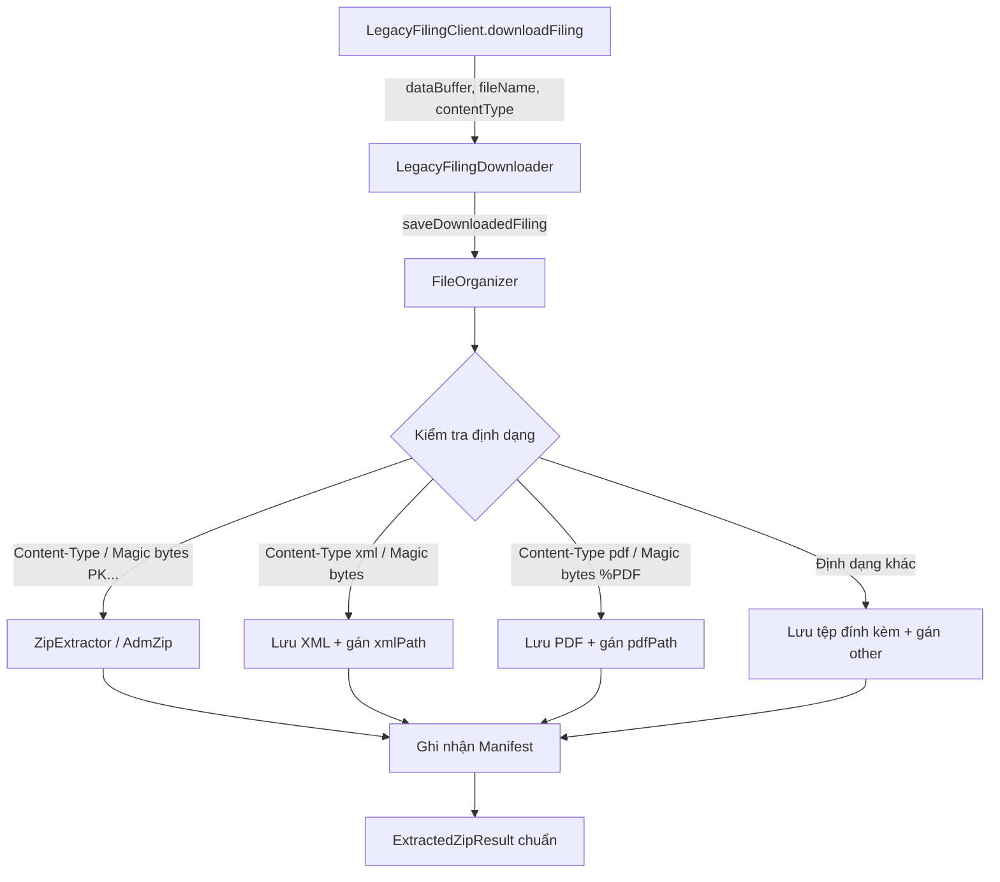

# Phase 1: Payload Preservation & Polymorphic Storage

## Overview

Khắc phục lỗi kiến trúc nghiêm trọng nhất (Audit #1 và Audit #10): Bảo toàn trọn vẹn tệp tờ khai eTax tải về từ máy chủ Thuế (bao gồm `dataBuffer`, `fileName` và `contentType`), chấm dứt việc ép toàn bộ tệp qua hàm giải nén ZIP `saveExtractedFiling()`, và nhận diện chính xác đuôi mở rộng tệp (`.xml`, `.pdf`) thay vì giả định tệp đầu tiên luôn là XML khi kiểm tra tệp đã tồn tại.

## Requirements

- **Functional Requirements:**
  - `FileOrganizer` phải cung cấp phương thức lưu trữ đa hình `saveDownloadedFiling()` có khả năng tiếp nhận cả `Buffer` hoặc `Base64 string`, kèm theo `fileName` gốc từ header `Content-Disposition` và `contentType`.
  - Phân loại và xử lý lưu trữ theo định dạng tệp thực tế:
    - **ZIP:** Giải nén an toàn chống Zip-Slip, giải mã nội dung và bóc tách các tệp bên trong.
    - **XML:** Làm sạch BOM/whitespace (`cleanXmlBuffer`), xác thực cú pháp XML hồ sơ thuế, lưu tệp với tên an toàn và hash SHA-256, gán đúng `xmlPath`.
    - **PDF:** Lưu trực tiếp buffer PDF với hash SHA-256, gán đúng `pdfPath`.
    - **Tệp đính kèm khác:** Lưu tệp an toàn và ghi nhận đường dẫn vào mảng `other`.
  - Không ném lỗi `File không đúng định dạng ZIP` khi máy chủ eTax trả về tệp XML trực tiếp, PDF trực tiếp hoặc file đính kèm hợp lệ.
  - Sửa `checkPreDownloadStatus` trong `FileOrganizer` và `LegacyFilingDownloader`: Phân loại mảng `savedPaths` dựa trên đuôi mở rộng (`path.extname`) để gán chính xác `xml` và `pdf` trong `downloadedFiles`.

- **Non-functional Requirements:**
  - Đảm bảo tính toàn vẹn dữ liệu: Tính hash SHA-256 cho từng tệp được lưu.
  - Ghi nhận đầy đủ thông tin vào `Manifest` hàng năm (`Manifest.recordDownload`).
  - Duy trì tương thích ngược 100% với hàm `saveExtractedFiling` hiện có để không làm ảnh hưởng các luồng DVC cũ.

## Architecture



## Related Code Files

- Modify: `src/main/files/FileOrganizer.ts` (Thêm `saveDownloadedFiling`, sửa `checkPreDownloadStatus`)
- Modify: `src/main/files/ZipExtractor.ts` (Bổ sung helper lưu trực tiếp Buffer có kiểm tra collision và phân loại)
- Modify: `src/main/downloader/LegacyFilingDownloader.ts` (Thay đổi lời gọi lưu tệp, truyền đủ `fileName` và `contentType`)
- Modify: `src/main/downloader/DownloadManager.ts` (Đồng bộ hóa lời gọi lưu tệp khi nhận `legacyFile`)

## Implementation Steps

1. **Mở rộng `FileOrganizer.ts`:**
   - Định nghĩa interface `SaveFilingPayloadOptions`:
     ```ts
     export interface SaveFilingPayloadOptions {
       content: Buffer | string; // Buffer hoặc Base64 string
       fileName?: string;
       contentType?: string;
       filing: TaxFiling;
       taxCode: string;
       year: number;
     }
     ```
   - Xây dựng phương thức `saveDownloadedFiling(options: SaveFilingPayloadOptions): ExtractedZipResult`.
   - Kiểm tra định dạng đầu vào:
     - Nếu buffer là ZIP (magic bytes `PK\x03\x04` hoặc contentType chứa `zip`): gọi `ZipExtractor.extractBase64Zip()`.
     - Nếu buffer là XML (bắt đầu bằng `<?xml`, `<HSoThueDTu`, ... hoặc contentType chứa `xml`): lưu tệp với đuôi `.xml`, ghi nhận `xmlPath`.
     - Nếu buffer là PDF (bắt đầu bằng `%PDF` hoặc contentType chứa `pdf`): lưu tệp với đuôi `.pdf`, ghi nhận `pdfPath`.
     - Nếu là tệp khác: lưu tệp an toàn theo `fileName` đã sanitize, ghi nhận vào `other`.
   - Ghi nhận vào `manifest.recordDownload(...)` tương tự `saveExtractedFiling`.

2. **Sửa nhận diện loại tệp trong `checkPreDownloadStatus` (`FileOrganizer.ts`):**
   - Không gán cố định `xml = check.savedPaths[0]`.
   - Duyệt qua `check.savedPaths`:
     ```ts
     const xmlPath = check.savedPaths.find(p => p.toLowerCase().endsWith('.xml'));
     const pdfPath = check.savedPaths.find(p => p.toLowerCase().endsWith('.pdf'));
     const otherPaths = check.savedPaths.filter(p => p !== xmlPath && p !== pdfPath);
     ```

3. **Cập nhật `LegacyFilingDownloader.ts`:**
   - Tại dòng 249–261, thay thế:
     ```ts
     const result = await this.client.downloadFiling(targetId, itemController.signal);
     const saveResult = this.fileOrganizer.saveDownloadedFiling({
       content: result.dataBuffer,
       fileName: result.fileName,
       contentType: result.contentType,
       filing: item.filing,
       taxCode: this.taxCode,
       year: filingYear
     });
     ```
   - Tại dòng 119–122 (khi enqueue kiểm tra tệp có sẵn), phân loại đúng `xml` và `pdf` theo phần mở rộng của đường dẫn.

4. **Đồng bộ hóa trong `DownloadManager.ts`:**
   - Tại các điểm nhận `legacyFile` (dòng 432–444, 473–483, 534–544), truyền `fileName` và `contentType` vào `saveDownloadedFiling` thay vì ép qua `saveExtractedFiling(payload.content)`.

## Success Criteria

- [x] `FileOrganizer.saveDownloadedFiling` xử lý thành công buffer XML thô, PDF thô và ZIP nén mà không văng ngoại lệ.
- [x] Tên tệp gốc từ server được tôn trọng và làm sạch qua `sanitizeFilename`.
- [x] `checkPreDownloadStatus` và hàng đợi nhận diện chính xác file PDF là `pdf` và file XML là `xml` dựa trên extension.
- [x] Tệp được lưu đầy đủ vào đĩa và ghi nhận chính xác trong file `manifest.json` của thư mục năm tương ứng.

## Risk Assessment

- **Rủi ro:** Một số tệp ZIP từ eTax bị lỗi nhẹ phần header (thiếu EOCD record) hoặc bị nén Deflate thô.
  - *Tín hiệu:* `AdmZip` ném lỗi không thể mở tệp.
  - *Biện pháp đối phó:* Kế thừa toàn bộ logic phục hồi tệp (`repairZipMissingEocd`, `recoverTruncatedZip`, `extractEmbeddedXml`) đã có sẵn trong `ZipExtractor`.
