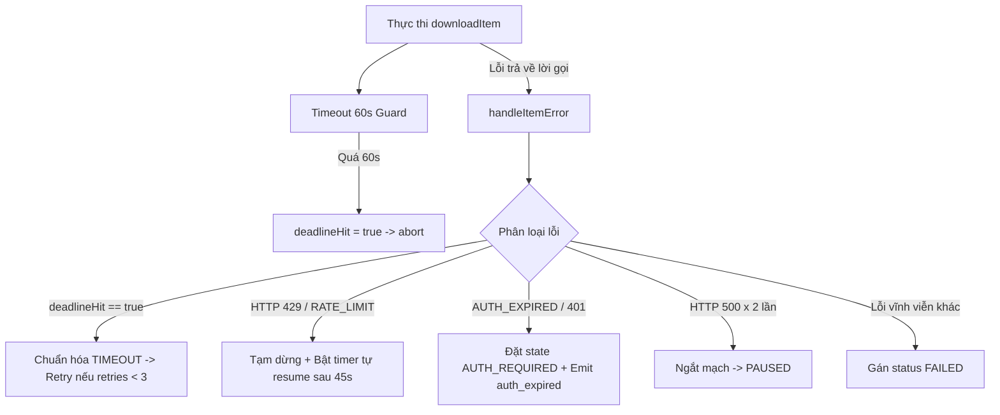

# Phase 2: Error Domain, Classification & Auto-Recovery

## Overview

Khắc phục 3 lỗi vận hành cốt lõi khiến tiến trình tải bị đóng băng hoặc thất bại oan uổng (Audit #5, #6, #7): Xử lý đúng trạng thái phiên hết hạn (`AUTH_REQUIRED`), chuẩn hóa phân biệt lỗi quá thời gian 60 giây (`TIMEOUT`) để kích hoạt cơ chế tự động thử lại thay vì đánh rớt ngay lập tức, và thiết lập bộ đếm thời gian tự động tiếp tục (`rateLimitCooldownTimer`) sau khi máy chủ phản hồi HTTP 429 thay vì tạm dừng vĩnh viễn.

## Requirements

- **Functional Requirements:**
  - **Nhận diện HTTP 429 & Tự phục hồi:**
    - Đọc đầy đủ các trường HTTP status từ lỗi: `error?.response?.status`, `error?.httpStatus`, và `error?.status`.
    - Nhận diện mã lỗi `RATE_LIMIT` hoặc status `429`.
    - Khi bị rate limit, kích hoạt `TaxPortalClient.triggerGlobalRateLimit(4_000)` VÀ khởi tạo timer `rateLimitCooldownTimer` (mặc định 45.000ms từ `PORTAL_CONFIG.RATE_LIMIT_COOLDOWN_MS`).
    - Khi hết thời gian cooldown, downloader tự động gọi `this.resume()` nếu hàng đợi vẫn đang ở trạng thái `PAUSED` và chưa bị hủy.
  - **Phân loại Timeout 60s & Retry tạm thời:**
    - Quản lý `deadline` tải từng mục (`ITEM_DEADLINE_MS = 60_000`): Khởi tạo cờ `deadlineHit = false`.
    - Khi deadline kích hoạt, đặt `deadlineHit = true` trước khi gọi `itemController.abort()`.
    - Khi bắt lỗi trong `catch`, nếu `deadlineHit === true`, chuẩn hóa lỗi thành mã `TIMEOUT` và thông báo `"Quá thời gian tải hồ sơ (60s)"`.
    - Cho phép lỗi `TIMEOUT` đi vào nhánh `isTransient` để thử lại tối đa 3 lần (`MAX_TRANSIENT_RETRIES = 3`) với thời gian giãn cách theo cấp số nhân (exponential backoff).
  - **Chuẩn hóa trạng thái Xác thực (Auth State):**
    - Bổ sung mã `'AUTH_REQUIRED'` vào danh sách kiểm tra mã xác thực: `['AUTH_EXPIRED', 'SESSION_EXPIRED', 'SSO_INTERACTIVE_REQUIRED', 'AUTH_REQUIRED']`.
    - Trong phương thức `start()` và `resume()`, khi preflight `ensureEtaxSession()` ném lỗi, kiểm tra xem có phải lỗi phiên làm việc không để truyền `authRequired = true` vào `pauseForAuthOrInfrastructure(error, isAuth)`.
    - Khi `authRequired === true`, đặt `this.state = 'AUTH_REQUIRED'` và phát sự kiện `auth_expired` để UI hiển thị modal đăng nhập lại.

- **Non-functional Requirements:**
  - Đảm bảo dọn dẹp sạch sẽ `clearTimeout` của `rateLimitCooldownTimer` khi người dùng bấm Hủy (`cancel()`) hoặc Dọn hàng đợi (`clearQueue()`).
  - Timer sử dụng `.unref()` (nếu khả dụng) để không chặn tiến trình Node.js/Electron thoát.

## Architecture



## Related Code Files

- Modify: `src/main/downloader/LegacyFilingDownloader.ts`
- Modify: `src/main/downloader/DownloadManager.ts` (Kiểm tra đối chiếu tính nhất quán của bộ đếm thời gian 429)

## Implementation Steps

1. **Chuẩn hóa hàm bóc tách mã lỗi và trạng thái HTTP trong `LegacyFilingDownloader.ts`:**
   ```ts
   private extractHttpStatus(error: any): number {
     return Number(error?.response?.status || error?.httpStatus || error?.status || 0);
   }

   private isAuthError(error: any): boolean {
     const code = String(error?.code || '');
     const status = this.extractHttpStatus(error);
     const msg = String(error?.message || '').toLowerCase();
     return (
       ['AUTH_EXPIRED', 'SESSION_EXPIRED', 'SSO_INTERACTIVE_REQUIRED', 'AUTH_REQUIRED'].includes(code) ||
       status === 401 ||
       msg.includes('hết phiên') ||
       msg.includes('đăng nhập')
     );
   }
   ```

2. **Cập nhật tiền kiểm Preflight trong `start()` và `resume()`:**
   ```ts
   try {
     await this.client.ensureEtaxSession();
   } catch (error: any) {
     const isAuth = this.isAuthError(error);
     this.pauseForAuthOrInfrastructure(error, isAuth);
     if (isAuth) {
       this.emit('auth_expired', { message: error?.message || 'Phiên làm việc eTax đã hết hạn' });
     }
     throw error;
   }
   ```

3. **Cải tiến `downloadItem` với `deadlineHit`:**
   ```ts
   let deadlineHit = false;
   const itemController = new AbortController();
   const queueAbort = () => itemController.abort();
   this.abortController?.signal.addEventListener('abort', queueAbort, { once: true });
   const deadline = setTimeout(() => {
     deadlineHit = true;
     itemController.abort();
   }, ITEM_DEADLINE_MS);

   try {
     // ... download & save ...
   } catch (error: any) {
     if (!this.isGenerationActive(generation)) return;
     if (deadlineHit) {
       error = Object.assign(new Error('Thời gian tải tờ khai vượt quá 60 giây (Timeout)'), {
         code: 'TIMEOUT',
         isTimeout: true
       });
     }
     await this.handleItemError(item, error, generation);
   } finally {
     clearTimeout(deadline);
     this.abortController?.signal.removeEventListener('abort', queueAbort);
   }
   ```

4. **Bổ sung Timer tự phục hồi khi gặp HTTP 429:**
   - Thêm thuộc tính `private rateLimitCooldownTimer: NodeJS.Timeout | null = null;`.
   - Trong `handleItemError`:
     ```ts
     if (isRateLimited) {
       item.status = 'PENDING';
       item.progressPercent = 0;
       const cooldownMs = PORTAL_CONFIG.RATE_LIMIT_COOLDOWN_MS || 45_000;
       TaxPortalClient.triggerGlobalRateLimit(4_000);
       this.pauseForAuthOrInfrastructure(error, false);
       this.emit('rate_limited', {
         item,
         message: `Máy chủ Cổng Thuế giới hạn tần suất yêu cầu (HTTP 429). Tự động thử lại sau ${Math.round(cooldownMs / 1000)}s...`,
         cooldownMs,
         resumeAt: Date.now() + cooldownMs
       });

       this.clearRateLimitCooldown();
       this.rateLimitCooldownTimer = setTimeout(async () => {
         if (this.isPaused && !this.isCancelled) {
           console.log(`[LegacyFilingDownloader] Hết thời gian chờ 429 (${cooldownMs}ms) -> tự động resume hàng đợi`);
           await this.resume().catch(e => console.warn('[LegacyFilingDownloader] Tự động resume thất bại:', e));
         }
       }, cooldownMs);
       if (typeof this.rateLimitCooldownTimer.unref === 'function') {
         this.rateLimitCooldownTimer.unref();
       }
       return;
     }
     ```
   - Thêm phương thức dọn dẹp `clearRateLimitCooldown()` và gọi trong `pause()`, `cancel()`, `clearQueue()`.

## Success Criteria

- [x] Lỗi HTTP 429 khiến hàng đợi chuyển `PAUSED`, phát event `rate_limited` và tự động `resume` sau cooldown mà không bị treo vĩnh viễn.
- [x] Khi mạng lag quá 60s, hồ sơ không bị coi là lỗi hủy mà được retry tối đa 3 lần qua exponential backoff.
- [x] Khi phiên làm việc eTax hết hạn ở bước preflight hoặc giữa chừng, trạng thái downloader là `AUTH_REQUIRED`, phát đúng event `auth_expired`.
- [x] Khi người dùng chủ động nhấn `pause()` hoặc `cancel()`, các timer đang chờ bị hủy bỏ ngay lập tức.

## Risk Assessment

- **Rủi ro:** Khi tự động resume sau 429, phiên eTax có thể đã bị hết hạn trong lúc chờ.
  - *Tín hiệu:* Lời gọi `resume()` ném lỗi `AUTH_EXPIRED`.
  - *Biện pháp đối phó:* Hàm `resume()` gọi `ensureEtaxSession(true)`, nếu phát hiện hết hạn sẽ lập tức chuyển sang `AUTH_REQUIRED` và thông báo cho người dùng một cách an toàn.
