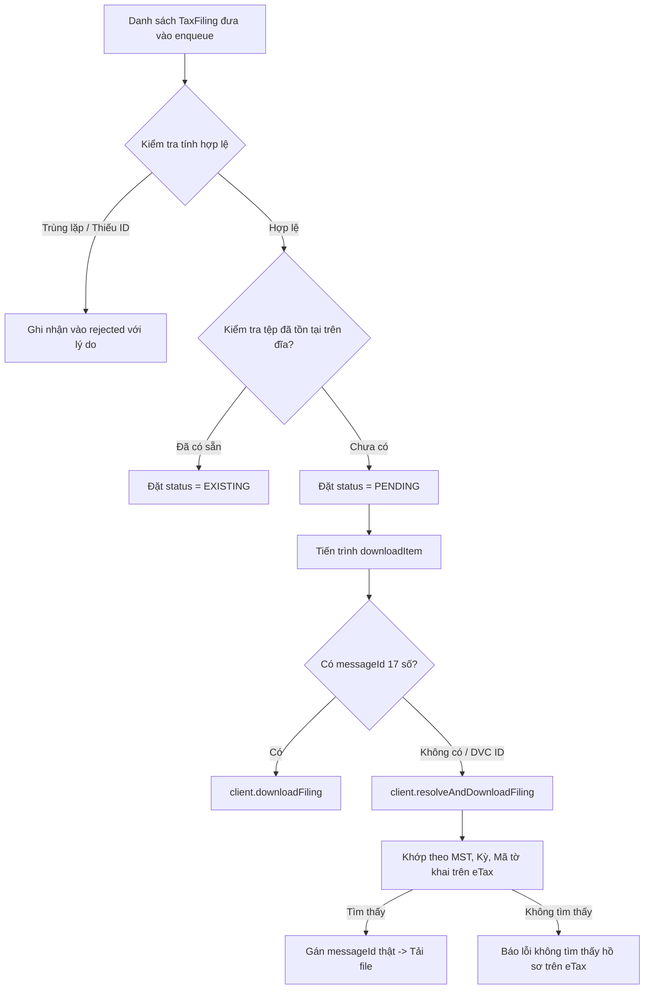

# Phase 3: Identifier Resolution & Enqueue Validation

## Overview

Khắc phục 2 lỗi định danh và tiếp nhận hồ sơ nghiêm trọng (Audit #3 và Audit #4): Chấm dứt việc tự ý gán `messageId = filing.id` gây lỗi tìm kiếm hồ sơ trên Cổng eTax, đồng thời xóa bỏ điều kiện lọc ngầm (`source === 'dvc-etax-html'`) làm biến mất hồ sơ của người dùng mà không có lý do. Thiết lập cơ chế tự động tra cứu eTax dự phòng (`resolveAndDownloadFiling`) khi hồ sơ chưa có sẵn `messageId`.

## Requirements

- **Functional Requirements:**
  - **Minh bạch hóa việc Enqueue hồ sơ:**
    - Không lọc cứng `filing.source !== 'dvc-etax-html'`. Tiếp nhận tất cả hồ sơ được người dùng chọn tải trong phiên tra cứu tờ khai năm cũ.
    - Phương thức `enqueueFilings` trả về thông tin tiếp nhận có cấu trúc hoặc ghi log chi tiết:
      - Số lượng hồ sơ được chấp nhận (`accepted`).
      - Số lượng hồ sơ đã tải sẵn trên đĩa (`existing`).
      - Danh sách hồ sơ bị từ chối kèm lý do cụ thể (`rejected: { filingId, title, reason }`) thay vì âm thầm `continue`.
    - Khi danh sách trống, đưa ra thông báo lỗi chi tiết thay vì câu thông báo chung chung.
  - **Phân giải định danh `messageId` chuẩn xác:**
    - Chỉ coi `messageId` là mã tải eTax hợp lệ nếu:
      - Có trường `filing.messageId` rõ ràng.
      - Hoặc `filing.id` là chuỗi 17 chữ số thuần túy tuân theo định dạng thông điệp eTax (`/^\d{17}$/`).
    - Tuyệt đối không tự ý gán mã hồ sơ DVC (ví dụ `000.701.18.G12-...` hoặc `G12.18-...`) vào `filing.messageId`.
  - **Tự động Tra cứu và Khớp hồ sơ eTax (`resolveAndDownloadFiling`):**
    - Trong hàm `downloadItem`:
      - Nếu hồ sơ ĐÃ CÓ `messageId` hợp lệ: gọi trực tiếp `this.client.downloadFiling(messageId, signal)`.
      - Nếu hồ sơ CHƯA CÓ `messageId`: tự động gọi `this.client.resolveAndDownloadFiling(this.taxCode, item.filing, signal)`. Phương thức này sẽ tra cứu bảng tờ khai eTax theo năm, kỳ tính thuế và mã tờ khai, tìm `messageId` thực tế và tải về.
      - Khi khớp thành công, cập nhật ngược lại `item.filing.messageId` để phục vụ các lần tra cứu sau.

- **Non-functional Requirements:**
  - Tối ưu hóa số lượng request: Ghi nhớ ánh xạ giữa tờ khai và `messageId` trong phiên làm việc.
  - Đảm bảo an toàn luồng dữ liệu: Không làm biến dạng dữ liệu gốc của `TaxFiling` truyền vào.

## Architecture



## Related Code Files

- Modify: `src/main/downloader/LegacyFilingDownloader.ts`
- Modify: `src/main/portal/LegacyFilingClient.ts` (Kiểm tra lại `resolveAndDownloadFiling`)

## Implementation Steps

1. **Chuẩn hóa kiểm tra `messageId` trong `LegacyFilingDownloader.ts`:**
   ```ts
   private isValidEtaxMessageId(id?: string): boolean {
     if (!id) return false;
     const trimmed = String(id).trim();
     return /^\d{17}$/.test(trimmed);
   }
   ```

2. **Tái cấu trúc `enqueueFilings`:**
   ```ts
   public enqueueFilings(
     filings: TaxFiling[],
     taxCode?: string,
     year?: number
   ): { accepted: number; existing: number; rejected: Array<{ id: string; reason: string }> } {
     // ... thiết lập ngữ cảnh taxCode, year ...
     const seenIds = new Set<string>();
     const rejected: Array<{ id: string; reason: string }> = [];

     for (const filing of filings) {
       const rawId = String(filing.id || filing.messageId || '').trim();
       if (!rawId) {
         rejected.push({ id: '(unknown)', reason: 'Hồ sơ thiếu cả id và messageId' });
         continue;
       }
       if (seenIds.has(rawId)) {
         rejected.push({ id: rawId, reason: 'Trùng lặp ID trong danh sách tải' });
         continue;
       }
       seenIds.add(rawId);

       // Xác định messageId eTax chuẩn nếu có
       const explicitMsgId = this.isValidEtaxMessageId(filing.messageId)
         ? filing.messageId
         : this.isValidEtaxMessageId(filing.id)
           ? filing.id
           : undefined;

       const normalizedFiling: TaxFiling = {
         ...filing,
         id: rawId,
         messageId: explicitMsgId || filing.messageId,
         source: filing.source || 'dvc-etax-html'
       };

       // ... Kiểm tra checkPreDownloadStatus và đẩy vào queue ...
     }

     return {
       accepted: this.queue.filter(q => q.status === 'PENDING').length,
       existing: this.queue.filter(q => q.status === 'EXISTING').length,
       rejected
     };
   }
   ```

3. **Tự động Fallback trong `downloadItem`:**
   Tại dòng gọi tải file, thay vì gọi mù quáng `this.client.downloadFiling(messageId || id)`:
   ```ts
   const targetMsgId = this.isValidEtaxMessageId(item.filing.messageId)
     ? item.filing.messageId
     : this.isValidEtaxMessageId(item.filing.id)
       ? item.filing.id
       : undefined;

   let result: { dataBuffer: Buffer; fileName: string; contentType: string };

   if (targetMsgId) {
     result = await this.client.downloadFiling(targetMsgId, itemController.signal, filingYear);
   } else {
     // Chưa có messageId eTax chuẩn -> tra cứu động trên Cổng eTax
     console.log(`[LegacyFilingDownloader] Hồ sơ ${item.filingId} chưa có messageId eTax -> tự động resolveAndDownloadFiling`);
     result = await this.client.resolveAndDownloadFiling(
       this.taxCode,
       item.filing,
       itemController.signal
     );
   }
   ```

## Success Criteria

- [x] Các hồ sơ được tra cứu từ nhiều nguồn hoặc hồ sơ DVC không còn bị bỏ qua âm thầm khi enqueue.
- [x] Hồ sơ không có `messageId` eTax 17 số kích hoạt thành công cơ chế `resolveAndDownloadFiling`, tự động tìm và tải đúng tờ khai từ Cổng eTax.
- [x] Mã hồ sơ DVC không còn bị gửi nhầm sang endpoint `downTkhai` của eTax.
- [x] Enqueue trả về danh sách rejected rõ ràng khi dữ liệu đầu vào không hợp lệ.

## Risk Assessment

- **Rủi ro:** Một hồ sơ trên eTax có tên hoặc kỳ tính thuế được định dạng hơi khác so với DVC (ví dụ "Quý 1/2022" vs "Q1/2022").
  - *Tín hiệu:* `resolveAndDownloadFiling` không tìm thấy hồ sơ khớp và ném lỗi.
  - *Biện pháp đối phó:* Hàm `resolveAndDownloadFiling` trong `LegacyFilingClient` đã hỗ trợ so khớp nhiều tầng (`matchByPeriod`, `matchByCode`, `altIds`). Nếu vẫn không tìm thấy, hệ thống sẽ báo lỗi rõ ràng `"Không tìm thấy tờ khai tương ứng trên eTax"` thay vì ném lỗi HTTP không xác định.
