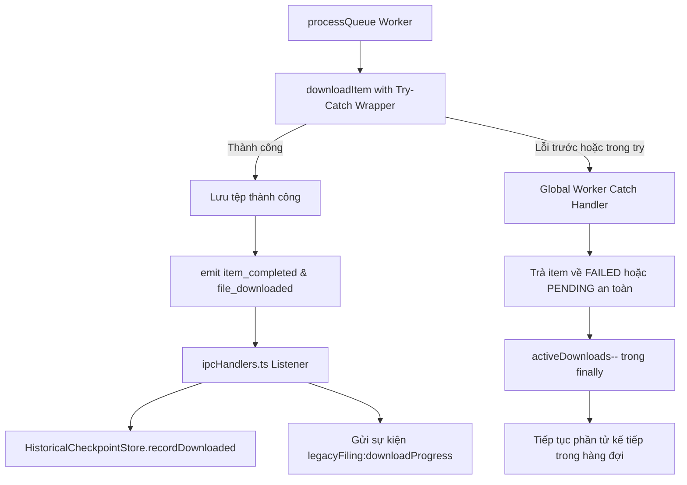

# Phase 4: Queue Lifecycle, State Math & Checkpoint Persistence

## Overview

Khắc phục 3 lỗi về tính toàn vẹn trạng thái và lưu trữ tiến độ (Audit #2, #8, #9): Kết nối việc lưu checkpoint tức thời vào `HistoricalCheckpointStore` khi tải xong từng tờ khai năm cũ, sửa triệt để tính toán hàng đợi `getSummary()` và trạng thái hủy (`cancel()`), đồng thời thiết lập rào chắn bắt lỗi toàn diện (`Unhandled Rejection Guard`) để không bao giờ để worker bị kẹt ở trạng thái `DOWNLOADING`.

## Requirements

- **Functional Requirements:**
  - **Lưu Checkpoint Tức thời cho Tờ khai Năm cũ:**
    - `LegacyFilingDownloader` phát sự kiện `item_completed` (chuẩn hóa tương đương `DownloadManager`) chứa `{ item, saveResult, summary }`, đồng thời giữ `file_downloaded` để tương thích ngược.
    - Trong `ipcHandlers.ts`: Đăng ký lắng nghe sự kiện tải thành công từ `legacyFilingDownloader` và lập tức gọi `historicalCheckpointStore.recordDownloaded(taxCode, year, messageId)` (hoặc cập nhật mảng `downloadedMessageIds`).
    - Giúp người dùng khi tắt ứng dụng hoặc mất kết nối thì lần sau mở lại vẫn giữ nguyên trạng thái đã tải, không phải quét và tải lại từ đầu.
  - **Chuẩn hóa Trạng thái Cancel & Toán học Summary:**
    - Khi người dùng gọi `cancel()`:
      - Chuyển `item.status = 'CANCELLED'`.
      - Cập nhật đồng bộ `item.filing.downloadStatus = 'CANCELLED'`.
      - Ghi nhận `item.filing.downloadError = 'Đã hủy tiến trình tải tờ khai'`.
    - Trong `getSummary()`:
      - Đếm tường minh số lượng `cancelled`.
      - Công thức tính `remaining` chính xác: `remaining = Math.max(0, total - completed - existing - failed - cancelled)`.
      - Đảm bảo bất biến: `total === completed + existing + failed + cancelled + downloading + pending`.
      - Bổ sung trường `cancelled` vào interface `DownloadSummary`.
  - **Bảo vệ Ngoại lệ Unhandled Rejection:**
    - Toàn bộ thân hàm `downloadItem` (bao gồm các bước trước khối `try` như cập nhật status, `emitProgress`, `delay`) phải được bọc trong khối bảo vệ hoặc đảm bảo không văng ngoại lệ ra ngoài.
    - Trong `processQueue`: Thêm `.catch()` tường minh vào lời gọi `downloadItem` trước khi vào `.finally()`:
      ```ts
      void this.downloadItem(nextItem, generation)
        .catch(err => {
          console.error('[LegacyFilingDownloader] Bắt được lỗi unhandled trong worker:', err);
          this.handleFatalWorkerError(nextItem, err, generation);
        })
        .finally(() => { ... });
      ```

- **Non-functional Requirements:**
  - Giữ vững tính bất biến (immutability) của dữ liệu checkpoint.
  - Hiệu năng cao: Ghi checkpoint theo cơ chế debounced hoặc atomic write để không làm chậm luồng tải.

## Architecture



## Related Code Files

- Modify: `src/main/downloader/LegacyFilingDownloader.ts`
- Modify: `src/main/ipc/ipcHandlers.ts`
- Modify: `src/shared/types.ts` (Bổ sung trường `cancelled` vào `DownloadSummary`)

## Implementation Steps

1. **Cập nhật Interface `DownloadSummary` trong `src/shared/types.ts`:**
   ```ts
   export interface DownloadSummary {
     total: number;
     completed: number;
     existing: number;
     failed: number;
     downloading: number;
     pending: number;
     cancelled?: number; // Mới
     remaining: number;
     isPaused: boolean;
     isCancelled: boolean;
     isRunning: boolean;
     state: DownloadState;
   }
   ```

2. **Cải tiến `getSummary` và `cancel` trong `LegacyFilingDownloader.ts`:**
   ```ts
   public cancel() {
     this.invalidateWorkers();
     this.clearRateLimitCooldown();
     this.isCancelled = true;
     this.isPaused = false;
     this.state = 'CANCELLED';
     for (const item of this.queue) {
       if (item.status === 'PENDING' || item.status === 'DOWNLOADING') {
         item.status = 'CANCELLED';
         item.progressPercent = 0;
         item.filing.downloadStatus = 'CANCELLED';
         item.filing.downloadError = 'Đã hủy tiến trình tải hồ sơ';
       }
     }
     this.emit('cancelled', this.getSummary());
     this.emitProgress();
   }

   public getSummary(): DownloadSummary {
     let completed = 0;
     let existing = 0;
     let failed = 0;
     let downloading = 0;
     let pending = 0;
     let cancelled = 0;

     for (const item of this.queue) {
       switch (item.status) {
         case 'COMPLETED': completed++; break;
         case 'EXISTING': existing++; break;
         case 'FAILED': failed++; break;
         case 'DOWNLOADING': downloading++; break;
         case 'PENDING': pending++; break;
         case 'CANCELLED': cancelled++; break;
       }
     }
     const total = this.queue.length;
     const remaining = Math.max(0, total - completed - existing - failed - cancelled);

     return {
       total,
       completed,
       existing,
       failed,
       downloading,
       pending,
       cancelled,
       remaining,
       isPaused: this.isPaused,
       isCancelled: this.isCancelled,
       isRunning: this.state === 'RUNNING',
       state: this.state
     };
   }
   ```

3. **Thắt chặt an toàn ngoại lệ trong `downloadItem` và `processQueue`:**
   ```ts
   private processQueue(generation: number) {
     if (!this.isGenerationActive(generation)) return;

     while (this.activeDownloads < this.maxConcurrency) {
       const nextItem = this.queue.find(item => item.status === 'PENDING');
       if (!nextItem) break;
       this.activeDownloads++;

       void this.downloadItem(nextItem, generation)
         .catch(err => {
           console.error(`[LegacyFilingDownloader] Ngoại lệ ngoài ý muốn tại worker:`, err);
           if (this.isGenerationActive(generation)) {
             nextItem.status = 'FAILED';
             nextItem.error = err instanceof Error ? err.message : String(err);
             nextItem.filing.downloadStatus = 'FAILED';
             this.emit('file_failed', { item: nextItem, error: nextItem.error, summary: this.getSummary() });
           }
         })
         .finally(() => {
           if (generation !== this.queueGeneration) return;
           this.activeDownloads = Math.max(0, this.activeDownloads - 1);
           if (this.isGenerationActive(generation)) {
             this.processQueue(generation);
             this.finishIfDone();
           }
         });
     }
     this.finishIfDone();
   }
   ```

4. **Kết nối Checkpoint trong `ipcHandlers.ts`:**
   - Tại vị trí đăng ký sự kiện của `legacyFilingDownloader`:
     ```ts
     legacyFilingDownloader.on('file_downloaded', ({ item, summary }) => {
       auditLogger.log('SUCCESS', `Tải thành công tờ khai năm cũ: ${item.filing.title}`, item.filing.id);
       const taxCode = legacyFilingDownloader.taxCode;
       const year = item.filing.periodNormalized?.year || legacyFilingDownloader.year;
       if (isValidTaxCode(taxCode) && year) {
         try {
           historicalCheckpointStore.recordDownloadedFiling(taxCode, year, item.filing.messageId || item.filing.id);
         } catch (chkErr) {
           console.warn('[ipcHandlers] Không thể ghi checkpoint tờ khai năm cũ:', chkErr);
         }
       }
     });
     ```

## Success Criteria

- [x] Khi hủy tải, 100% item chưa tải chuyển thành `CANCELLED` và `filing.downloadStatus` được cập nhật tương ứng.
- [x] `summary.total === completed + existing + failed + cancelled + downloading + pending` luôn đúng trong mọi thời điểm.
- [x] Khi một tờ khai năm cũ tải thành công, tệp checkpoint của năm đó được cập nhật ngay lập tức.
- [x] Ngay cả khi listener của `emitProgress` ném ngoại lệ, tiến trình tải không bị đơ và worker không bị kẹt.

## Risk Assessment

- **Rủi ro:** Khi tải hàng loạt 50 hồ sơ liên tục, việc ghi checkpoint liên tục vào đĩa có thể gây I/O bottleneck.
  - *Tín hiệu:* Tải xong chậm do chờ ghi file JSON checkpoint.
  - *Biện pháp đối phó:* Phương thức `recordDownloadedFiling` trong `HistoricalCheckpointStore` có thể ghi in-memory và debounced flush sau 500ms hoặc ghi atomic.
