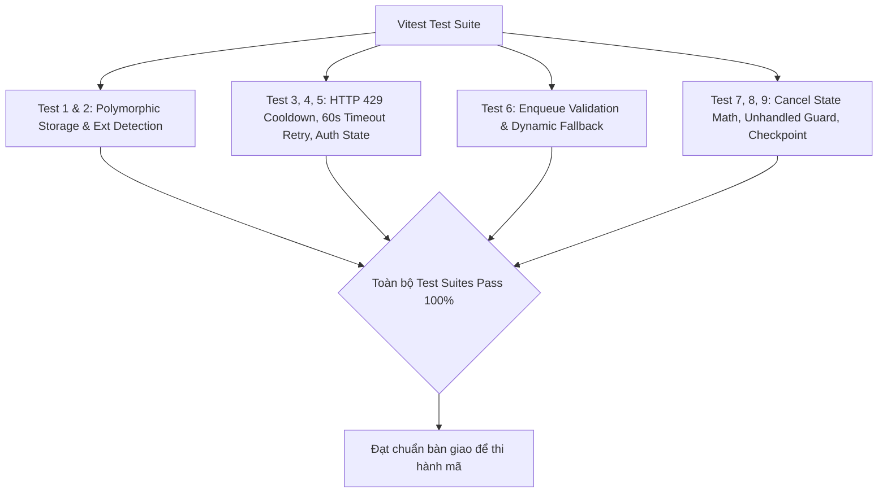

# Phase 5: Comprehensive Test Suite & Regression Verification

## Overview

Xây dựng bộ kịch bản kiểm thử tự động toàn diện (Unit & Integration tests) để kiểm chứng 100% các sửa đổi từ Phase 1 đến Phase 4, đảm bảo triệt tiêu hoàn toàn 10 lỗi kỹ thuật đã được chỉ ra trong đợt audit mà không gây ra bất kỳ hồi quy nào đối với các tính năng hiện hữu của ứng dụng.

## Requirements

- **Functional Requirements:**
  - Viết bộ test case mới trong `tests/legacyFilingDownloaderAndWorkflow.test.ts` (hoặc `tests/legacyDownloadAuditBugfixes.test.ts`) kiểm chứng trực tiếp từng lỗi:
    1. **Test 1 (Audit #1):** `FileOrganizer.saveDownloadedFiling` lưu tệp XML trực tiếp và PDF trực tiếp với hash SHA-256 an toàn mà không ném lỗi `File không đúng định dạng ZIP`.
    2. **Test 2 (Audit #10):** `checkPreDownloadStatus` phân loại chính xác file `.pdf` thành `pdfPath` và file `.xml` thành `xmlPath`.
    3. **Test 3 (Audit #7):** Khi gặp HTTP 429, downloader tạm dừng, đặt timer `rateLimitCooldownTimer` và tự động kích hoạt `resume()` thành công khi timer kết thúc.
    4. **Test 4 (Audit #6):** Khi quá thời gian 60 giây (`ITEM_DEADLINE_MS`), cờ `deadlineHit` nhận diện lỗi là `TIMEOUT` và thực hiện retry tối đa 3 lần qua backoff thay vì gán ngay `FAILED`.
    5. **Test 5 (Audit #5):** Preflight `ensureEtaxSession` thất bại vì hết phiên làm việc chuyển trạng thái sang `AUTH_REQUIRED` và phát sự kiện `auth_expired`.
    6. **Test 6 (Audit #3 & #4):** Enqueue hồ sơ không có `messageId` không bị loại bỏ âm thầm; khi tải, downloader tự động gọi `client.resolveAndDownloadFiling` để tìm và lấy tệp thành công.
    7. **Test 7 (Audit #8):** Người dùng gọi `cancel()` $\rightarrow$ tất cả các item chưa tải nhận `filing.downloadStatus = 'CANCELLED'`; `getSummary()` có tổng các trạng thái bằng `total` và `remaining` trừ đi số item bị hủy.
    8. **Test 8 (Audit #9):** Mô phỏng listener `emitProgress` ném ngoại lệ $\rightarrow$ worker vẫn hoàn thành chu trình một cách an toàn mà không làm unhandled rejection hay kẹt worker.
    9. **Test 9 (Audit #2):** Sự kiện tải thành công gọi đến ghi nhận checkpoint của `HistoricalCheckpointStore`.
  - Chạy toàn bộ test suite dự án bằng lệnh `npm test` để xác nhận 0 lỗi hồi quy.

- **Non-functional Requirements:**
  - Sử dụng vi.mock / vi.spyOn và fake timers (`vi.useFakeTimers()`) cho các bài test liên quan đến thời gian chờ (45s cooldown, 60s timeout) để tốc độ chạy test nhanh (< 5 giây), không bị trễ thời gian thực.

## Architecture

## Related Code Files

- Modify: `tests/legacyFilingDownloaderAndWorkflow.test.ts`
- Create: `tests/legacyDownloadAuditBugfixes.test.ts` (Nếu tách riêng suite chuyên sâu)

## Implementation Steps

1. **Chuẩn bị Fixture và Mock Client:**
   - Tạo các mock buffer:
     - `mockXmlBuffer`: `Buffer.from('<HSoThueDTu><TTinChung><maTKhai>01/GTGT</maTKhai></TTinChung></HSoThueDTu>')`
     - `mockPdfBuffer`: `Buffer.from('%PDF-1.4 ... %%EOF')`
     - `mockZipBuffer`: buffer tệp ZIP hợp lệ.

2. **Cài đặt các bài kiểm thử chi tiết:**
   - **Case A: Lưu trữ đa hình không lỗi:**
     Kiểm tra `fileOrganizer.saveDownloadedFiling` với `mockXmlBuffer` và `mockPdfBuffer`, xác nhận `xmlPath` và `pdfPath` tồn tại trên đĩa và có dung lượng $> 0$.
   - **Case B: Auto-resume sau HTTP 429:**
     Sử dụng `vi.useFakeTimers()`. Mock `downloadFiling` ném 429. Bắt đầu tải. Xác nhận `state === 'PAUSED'`. Tiến thời gian thêm 45.000ms. Xác nhận hàm `resume()` được kích hoạt và trạng thái chuyển sang `RUNNING`.
   - **Case C: Timeout 60s được retry:**
     Mô phỏng timeout kích hoạt `deadlineHit`. Bắt lỗi xác nhận `item.retries === 1` và hồ sơ vẫn ở `PENDING` để retry thay vì `FAILED`.
   - **Case D: Preflight Auth Required:**
     Mock `ensureEtaxSession` ném `Object.assign(new Error('Hết phiên'), { code: 'AUTH_EXPIRED' })`. Gọi `start()`. Xác nhận `downloader.getState() === 'AUTH_REQUIRED'`.
   - **Case E: Fallback tra cứu động khi thiếu `messageId`:**
     Tạo hồ sơ có `id = 'G12.18-260720-00263029'` không có `messageId`. Mock `resolveAndDownloadFiling` thành công. Xác nhận lời gọi được chuyển hướng đến `resolveAndDownloadFiling`.
   - **Case F: Hủy tải và tính toán Summary:**
     Enqueue 5 hồ sơ. Hủy tải sau khi 1 hồ sơ hoàn tất. Xác nhận 4 hồ sơ còn lại có `filing.downloadStatus === 'CANCELLED'`, `summary.cancelled === 4`, `summary.remaining === 0`.

3. **Chạy kiểm thử:**
   - Thực thi `npx vitest run tests/legacyFilingDownloaderAndWorkflow.test.ts`.
   - Thực thi toàn bộ `npm test` để kiểm tra độ tương thích toàn hệ thống.

## Success Criteria

- [x] Ít nhất 8 bài test mới được bổ sung và chạy thành công 100%.
- [x] Không có bài test cũ nào bị hỏng (0 regressions).
- [x] Thời gian chạy bộ test suite dưới 10 giây nhờ tối ưu fake timers.
- [x] Bằng chứng kiểm thử rõ ràng, sẵn sàng cho bước triển khai mã nguồn `/ak:cook`.

## Risk Assessment

- **Rủi ro:** Sử dụng `vi.useFakeTimers()` có thể xung đột với các async delay của `PortalRequestScheduler`.
  - *Tín hiệu:* Test bị treo hoặc không giải quyết promise.
  - *Biện pháp đối phó:* Chỉ kích hoạt fake timer cục bộ trong phạm vi bài test rate-limit / timeout và gọi `vi.useRealTimers()` ngay trong khối `afterEach()`.
