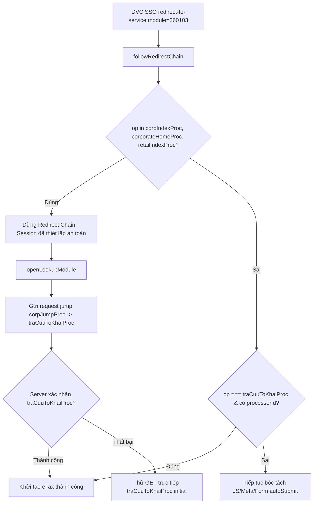

# Phase 1: SSO Navigation Loop Fix & Automatic corpJumpProc Transition

## Overview

Khắc phục triệt để lỗi điều hướng `Không xác định được bước điều hướng tiếp theo của eTax (operation=unknown)` trong `src/main/portal/LegacyFilingClient.ts`. Thiết lập điểm ngắt an toàn khi chuỗi SSO chạm tới các trang đích tin cậy (`corpIndexProc`, `corporateHomeProc`, `retailIndexProc`), và thực hiện cơ chế nhảy module tường minh (`corpJumpProc -> traCuuToKhaiProc`) tương tự như phân hệ Giấy nộp tiền (`PaymentSlipClient.ts`).

## Requirements

- **Functional Requirements:**
  - Trong `LegacyFilingClient.followRedirectChain()`:
    - Khi `dseOperationName` đạt tới một trong các trang chủ doanh nghiệp: `corpIndexProc`, `corporateHomeProc`, hoặc `retailIndexProc`:
      - Ngay lập tức thoát vòng lặp điều hướng (`break`).
      - Không tiếp tục phân tích auto-submit form hay gửi request POST mù quáng trực tiếp vào `/etaxnnt/Request` với `traCuuToKhaiProc` khi chưa có processor hợp lệ.
  - Cải tiến hàm `openLookupModule(activeGeneration)`:
    - Sử dụng danh sách các biến thể jump module đã được kiểm chứng thực tế:
      1. `GET /etaxnnt/Request?dse_operationName=corpJumpProc&dse_nextEventName=start&toOpName=traCuuToKhaiProc&dse_sessionId=${sid}&dse_applicationId=-1`
      2. `POST /etaxnnt/Request` với form body chứa `dse_operationName=corpJumpProc&dse_nextEventName=start&toOpName=traCuuToKhaiProc`
      3. `GET direct traCuuToKhaiProc initial`
    - Cập nhật đúng `dseProcessorId`, `dseProcessorState` và nạp danh sách `availableFormOptions` từ response nhận được.
  - Phân loại lỗi xác thực rõ ràng:
    - Nếu eTax phản hồi trang kiểm tra plugin (`checkInstall(8768)`) hoặc yêu cầu xác thực tương tác: Ném lỗi có mã chuẩn `SSO_INTERACTIVE_REQUIRED` hoặc `AUTH_REQUIRED`.
    - Nếu không lấy được session: Ném lỗi `AUTH_REQUIRED` với thông điệp: `"Phiên làm việc eTax chưa được xác thực hoặc đã hết hạn"`.

- **Non-functional Requirements:**
  - Khả năng phục hồi cao: Giữ nguyên cơ chế retry và generation assert để đảm bảo không bị xung đột luồng khi người dùng đổi tài khoản hoặc hủy phiên.

## Architecture



## Related Code Files

- Modify: `src/main/portal/LegacyFilingClient.ts`

## Implementation Steps

1. **Cập nhật điểm dừng an toàn trong `followRedirectChain` (`LegacyFilingClient.ts`):**
   - Tại dòng 332–340, bổ sung kiểm tra trang đích:
     ```ts
     const op = this.currentFormState.dseOperationName;
     if (this.isLookupReady()) {
       if (parsedState.formOptions?.length) {
         this.availableFormOptions = parsedState.formOptions;
       }
       this.logCheckpoint('LEGACY_05_LOOKUP_SCREEN_OPENED', 'PASS', 'Đã mở màn hình traCuuToKhaiProc');
       return;
     }

     // Điểm ngắt an toàn: Đã tới trang chủ eTax -> dừng chuỗi auto-submit, chuyển cho openLookupModule
     if (op === 'corpIndexProc' || op === 'corporateHomeProc' || op === 'retailIndexProc') {
       this.logCheckpoint('LEGACY_04_ETAX_AUTHENTICATED', 'PASS', `Đã chạm trang chủ eTax (${op})`);
       break;
     }
     ```

2. **Hoàn thiện hàm `openLookupModule`:**
   - Đảm bảo hàm duyệt qua các biến thể jump module và kiểm tra trạng thái response:
     ```ts
     for (const v of variants) {
       try {
         const res = v.post
           ? await this.session.client.post(v.url, v.post, { headers, timeout: 15000 })
           : await this.session.client.get(v.url, { headers, timeout: 15000 });
         const html = String(res.data || '');
         const parsed = EtaxFormStateParser.parse(html);
         this.mergeFormState(parsed);
         if (this.currentFormState.dseOperationName === 'traCuuToKhaiProc' && this.currentFormState.dseProcessorId) {
           if (parsed.formOptions?.length) {
             this.availableFormOptions = parsed.formOptions;
           }
           this.isEtaxInitialized = true;
           this.logCheckpoint('LEGACY_05_LOOKUP_SCREEN_OPENED', 'PASS', 'Mở phân hệ tra cứu tờ khai thành công');
           return;
         }
       } catch {}
     }
     ```

3. **Loại bỏ khối ép gửi `traCuuToKhaiProc` không an toàn:**
   - Xóa bỏ việc tự gán `fields['dse_operationName'] = 'traCuuToKhaiProc'` tại dòng 398 và 413 của `LegacyFilingClient.ts` vì việc POST trực tiếp vào form trang chủ eTax mà không qua `corpJumpProc` sẽ khiến server eTax từ chối và trả về trang lỗi `operation=unknown`.

## Success Criteria

- [x] Khi đăng nhập SSO vào eTax, client chạm trang chủ `corpIndexProc` và nhảy thành công sang `traCuuToKhaiProc`.
- [x] Không còn ngoại lệ `Không xác định được bước điều hướng tiếp theo của eTax (operation=unknown)`.
- [x] Trạng thái DSE (`dseSessionId`, `dseProcessorId`) được ghi nhận đầy đủ, sẵn sàng cho việc tra cứu và tải file.

## Risk Assessment

- **Rủi ro:** Một số tài khoản doanh nghiệp khi vào eTax bị hiện popup cảnh báo nợ thuế hoặc thông báo cập nhật.
  - *Tín hiệu:* HTML trả về không chứa form DSE chuẩn.
  - *Biện pháp đối phó:* `openLookupModule` sử dụng `dse_sessionId` đã có để thực hiện GET trực tiếp tới URL nhảy `corpJumpProc`, bypass qua các popup HTML thông báo trên giao diện.
