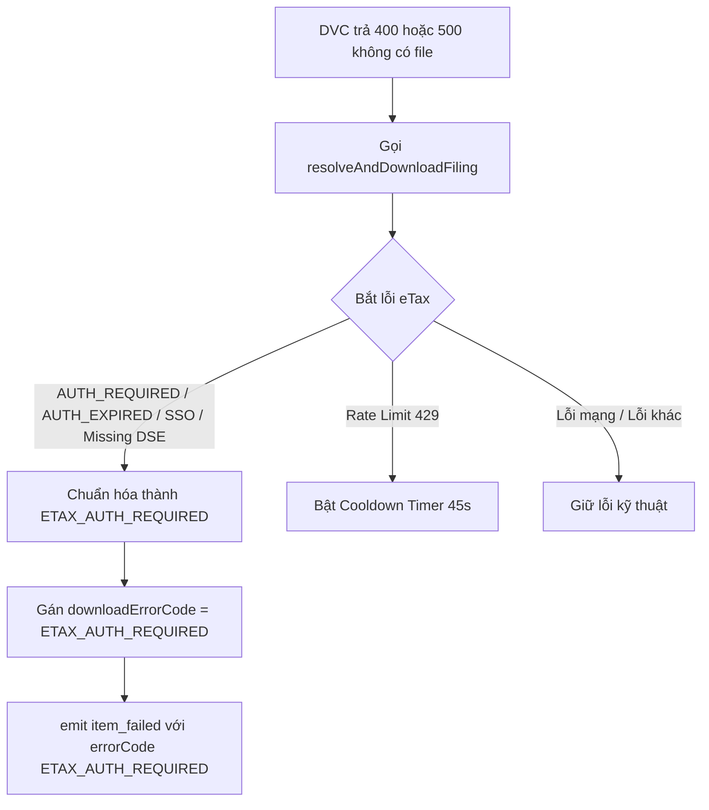

# Phase 2: Actionable Error Contract & DVC-400 Handling

## Overview

Chuẩn hóa hợp đồng xử lý lỗi trong `src/main/downloader/DownloadManager.ts`: Khi Cổng Dịch vụ công báo lỗi nghiệp vụ `validateIdTkhai === "400"` (tờ khai nộp qua kênh eTax, DVC không có tệp vật lý) và luồng fallback sang eTax gặp sự cố phiên làm việc, chuyển đổi toàn bộ thông báo lỗi kỹ thuật thô ráp thành mã lỗi có cấu trúc **`ETAX_AUTH_REQUIRED`** kèm thông điệp rõ ràng, làm tiền đề cho giao diện hiển thị nút xác thực trực tiếp.

## Requirements

- **Functional Requirements:**
  - Trong `DownloadManager.downloadItemWithWorker()`:
    - Khi Cổng DVC thất bại do:
      - `validateIdTkhai` trả về `"400"`.
      - Hoặc endpoint `downloadhoso` trả về 500 (`Hồ sơ truyền lên không hợp lệ`).
      - Và không có tệp đính kèm nào trên DVC.
    - Hệ thống chuyển tiếp gọi `this.legacyClient.resolveAndDownloadFiling(...)`.
    - Nếu lời gọi eTax ném lỗi liên quan đến xác thực phiên làm việc:
      - `AUTH_REQUIRED`
      - `AUTH_EXPIRED`
      - `SSO_INTERACTIVE_REQUIRED`
      - Hoặc lỗi do chưa có phiên DSE (`Phiên eTax chưa được xác thực`, `operation=unknown`)
    - Chuyển đổi thành lỗi nghiệp vụ chuẩn hóa:
      ```ts
      const authError = new Error(
        'Tờ khai lưu trữ trên Cổng Thuế Điện Tử (eTax). Vui lòng xác thực kết nối eTax để tải tệp gốc từ Cơ quan Thuế.'
      );
      Object.assign(authError, {
        code: 'ETAX_AUTH_REQUIRED',
        errorCode: 'ETAX_AUTH_REQUIRED',
        isEtaxAuthRequired: true
      });
      ```
  - Cập nhật dữ liệu trên `item`:
    - `item.status = 'FAILED'`.
    - `item.error = authError.message`.
    - `item.filing.downloadStatus = 'FAILED'`.
    - `item.filing.downloadError = authError.message`.
    - `item.filing.downloadErrorCode = 'ETAX_AUTH_REQUIRED'`.
  - Phát sự kiện `item_failed` mang theo `errorCode: 'ETAX_AUTH_REQUIRED'`.

- **Non-functional Requirements:**
  - Không làm ảnh hưởng tới các lỗi mạng thuần túy (Network Timeout, Server 500 thực sự từ eTax).
  - Không phá vỡ luồng tải bình thường đối với các hồ sơ DVC có sẵn tệp.

## Architecture



## Related Code Files

- Modify: `src/main/downloader/DownloadManager.ts`
- Modify: `src/shared/types.ts` (Thêm trường `downloadErrorCode?: string` vào interface `TaxFiling`)

## Implementation Steps

1. **Bổ sung trường `downloadErrorCode` trong `src/shared/types.ts`:**
   ```ts
   export interface TaxFiling {
     // ...
     downloadStatus?: 'PENDING' | 'DOWNLOADING' | 'COMPLETED' | 'EXISTING' | 'FAILED';
     downloadError?: string;
     downloadErrorCode?: string; // Mới: 'ETAX_AUTH_REQUIRED' | 'RATE_LIMIT' | 'TIMEOUT' ...
     // ...
   }
   ```

2. **Cập nhật khối catch fallback eTax trong `DownloadManager.ts`:**
   - Tại dòng 520–540:
     ```ts
     } catch (etaxFallbackErr: unknown) {
       const fallbackObj = etaxFallbackErr as { code?: string; status?: number; response?: { status?: number }; message?: string } | null | undefined;
       const isRateLimit = fallbackObj?.code === 'RATE_LIMIT' || fallbackObj?.status === 429 || fallbackObj?.response?.status === 429 || String(fallbackObj?.message).includes('429');
       const isAuth =
         fallbackObj?.code === 'SESSION_EXPIRED' ||
         fallbackObj?.code === 'AUTH_REQUIRED' ||
         fallbackObj?.code === 'AUTH_EXPIRED' ||
         fallbackObj?.code === 'SSO_INTERACTIVE_REQUIRED' ||
         String(fallbackObj?.message).includes('chưa được xác thực') ||
         String(fallbackObj?.message).includes('hết phiên') ||
         String(fallbackObj?.message).includes('operation=unknown');

       if (isRateLimit || fallbackObj?.code === 'CANCELLED') {
         throw etaxFallbackErr;
       }

       if (isAuth) {
         const combined = new Error(
           'Tờ khai lưu trữ trên Cổng Thuế Điện Tử (eTax). Cần xác thực phiên eTax để tải tệp gốc từ Cơ quan Thuế.'
         );
         Object.assign(combined, {
           code: 'ETAX_AUTH_REQUIRED',
           errorCode: 'ETAX_AUTH_REQUIRED',
           isEtaxAuthRequired: true
         });
         throw combined;
       }

       // ... Xử lý các lỗi khác như cũ ...
     }
     ```

3. **Gán `downloadErrorCode` tại `handleItemError` của `DownloadManager.ts`:**
   - Khi item gặp lỗi, kiểm tra `error?.code || error?.errorCode` để gán vào `item.filing.downloadErrorCode`.

## Success Criteria

- [x] Khi Cổng DVC không có tệp và eTax chưa có phiên, hồ sơ nhận đúng `downloadErrorCode = 'ETAX_AUTH_REQUIRED'`.
- [x] Thông báo lỗi trên hồ sơ ngắn gọn, lịch sự, hướng dẫn rõ ràng: *"Tờ khai lưu trữ trên Cổng Thuế Điện Tử (eTax)..."*, không còn chuỗi hex thô.
- [x] Sự kiện `item_failed` gửi kèm mã `errorCode: 'ETAX_AUTH_REQUIRED'` lên renderer qua IPC.

## Risk Assessment

- **Rủi ro:** Một số hồ sơ không có trên cả DVC lẫn eTax (hồ sơ ảo hoặc bị hủy bỏ trên hệ thống).
  - *Tín hiệu:* eTax trả về thông báo `"Không tìm thấy file tờ khai tương ứng trên eTax"`.
  - *Biện pháp đối phó:* Lỗi `"Không tìm thấy file"` không phải là lỗi xác thực nên không gán mã `ETAX_AUTH_REQUIRED`, mà giữ nguyên thông báo không tìm thấy để người dùng biết hồ sơ không tồn tại.
