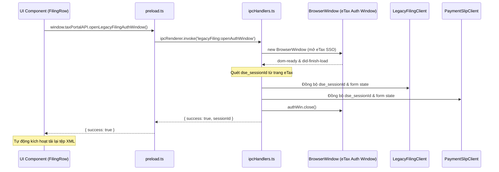

# Phase 3: IPC Bridge for Direct eTax Authentication

## Overview

Xây dựng cầu nối giao tiếp IPC (`legacyFiling:openAuthWindow`) cho phép giao diện Renderer mở cửa sổ trình duyệt tương tác để người dùng xác thực eTax tức thì từ bất kỳ dòng tờ khai nào. Đồng thời thiết lập cơ chế chia sẻ phiên làm việc eTax giữa phân hệ Tờ khai (`LegacyFilingClient`) và phân hệ Giấy nộp tiền (`PaymentSlipClient`), giúp chỉ cần xác thực một lần duy nhất.

## Requirements

- **Functional Requirements:**
  - **IPC Handler `legacyFiling:openAuthWindow`:**
    - Tạo handler xử lý trong `src/main/ipc/ipcHandlers.ts`.
    - Tận dụng hoặc mở rộng logic mở cửa sổ xác thực tương tác `BrowserWindow` có sẵn:
      - Tải trực tiếp URL chuyển tiếp SSO sang Cổng eTax (`module=360103` hoặc `module=330410`).
      - Lắng nghe sự kiện trang (`did-finish-load`, `dom-ready`, `did-navigate`) để tự động bóc tách `dse_sessionId` và cookie phiên eTax (`JSESSIONID`, `dse_sessionId`).
      - Khi nhận diện được phiên DSE hợp lệ:
        - Nạp trạng thái session vào `legacyFilingClient`.
        - Nạp trạng thái session vào `paymentSlipClient`.
        - Đóng cửa sổ xác thực và trả về kết quả `{ success: true, sessionId }`.
      - Khi người dùng đóng cửa sổ hoặc hết thời gian chờ (2 phút): Trả về `{ success: false, message }` an toàn, không làm treo IPC.
  - **Preload API Exposure:**
    - Trong `src/preload/preload.ts`, phơi bày hàm:
      ```ts
      openLegacyFilingAuthWindow: (options?: { forceInteractive?: boolean }) =>
        ipcRenderer.invoke('legacyFiling:openAuthWindow', options),
      ```
    - Khai báo type an toàn trong `src/preload/index.d.ts` (hoặc `TaxPortalAPI`).

- **Non-functional Requirements:**
  - Đảm bảo cửa sổ xác thực chỉ mở 1 instance tại một thời điểm (singleton pattern), tránh việc người dùng bấm nhiều lần làm mở nhiều popup chồng chéo.
  - Dọn dẹp sạch sẽ timer và event listener khi cửa sổ bị đóng.

## Architecture



## Related Code Files

- Modify: `src/main/ipc/ipcHandlers.ts`
- Modify: `src/preload/preload.ts`
- Modify: `src/main/portal/LegacyFilingClient.ts` (Bổ sung phương thức nhận session ngoài `adoptDseSessionState`)

## Implementation Steps

1. **Bổ sung phương thức nạp session trong `LegacyFilingClient.ts`:**
   ```ts
   public adoptDseSession(sessionId: string, currentUrl?: string, html?: string) {
     this.currentFormState.dseSessionId = sessionId;
     if (currentUrl) this.currentFormState.actionUrl = currentUrl;
     if (html) {
       const parsed = EtaxFormStateParser.parse(html);
       this.mergeFormState(parsed);
     }
     this.isEtaxInitialized = true;
     this.logCheckpoint('LEGACY_04_ETAX_AUTHENTICATED', 'PASS', `Adopted session: ***${sessionId.slice(-4)}`);
   }
   ```

2. **Cài đặt IPC Handler `legacyFiling:openAuthWindow` trong `ipcHandlers.ts`:**
   - Kết nối với `openPaymentSlipsAuthWindow`: Cho phép hai phân hệ dùng chung cửa sổ xác thực eTax vì cả hai đều đăng nhập vào cùng một hệ thống `thuedientu.gdt.gov.vn`.
   - Khi xác thực xong, gọi đồng bộ:
     ```ts
     legacyFilingClient.adoptDseSession(dseSessionId, res?.currentUrl, res?.html);
     ```

3. **Cập nhật `src/preload/preload.ts`:**
   - Thêm phương thức `openLegacyFilingAuthWindow` vào `window.taxPortalAPI`.

## Success Criteria

- [x] Gọi `window.taxPortalAPI.openLegacyFilingAuthWindow()` mở được cửa sổ xác thực eTax.
- [x] Khi cửa sổ hoàn tất đăng nhập, `legacyFilingClient` có ngay phiên eTax hợp lệ mà không cần chạy lại chuỗi SSO ngầm.
- [x] Hàm trả về `{ success: true }` cho renderer để sẵn sàng thực hiện bước tiếp theo.

## Risk Assessment

- **Rủi ro:** Cổng eTax chặn việc mở nhiều webview cùng lúc nếu cookie xung đột.
  - *Tín hiệu:* Trang eTax báo "Phiên làm việc đã bị hủy bởi tab khác".
  - *Biện pháp đối phó:* Sử dụng chung một `session.defaultSession` hoặc chia sẻ cookie jar đã được đồng bộ với Axios.
