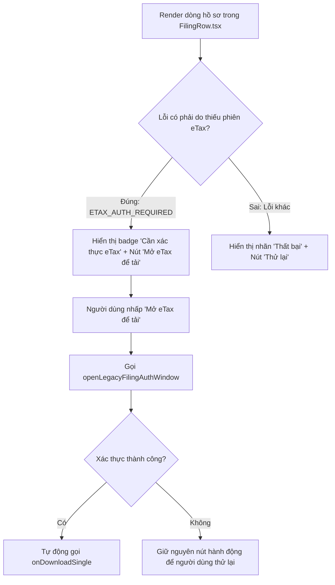

# Phase 4: Actionable State & Single-Click eTax Authentication in UI

## Overview

Cải tiến giao diện dòng hồ sơ `src/renderer/components/FilingRow.tsx` và điều phối tải lại trong `src/renderer/App.tsx`: Thay thế thông báo lỗi kỹ thuật màu đỏ thô ráp bằng trạng thái hành động thông minh (**Actionable State**). Khi tờ khai lưu trên eTax cần tệp gốc, giao diện hiển thị badge màu hổ phách `Cần xác thực eTax` cùng nút bấm `[Mở eTax để tải]`. Nhấp vào nút này sẽ mở cửa sổ xác thực và tự động tải file về máy ngay khi xác thực hoàn tất.

## Requirements

- **Functional Requirements:**
  - **Nhận diện trạng thái lỗi cần eTax trong `FilingRow.tsx`:**
    - Kiểm tra điều kiện:
      ```ts
      const isEtaxAuthNeeded =
        filing.downloadStatus === 'FAILED' &&
        (filing.downloadErrorCode === 'ETAX_AUTH_REQUIRED' ||
          filing.downloadError?.includes('Cổng Thuế Điện Tử') ||
          filing.downloadError?.includes('eTax'));
      ```
  - **Hiển thị Badge và Nút bấm Hành động:**
    - Khi `isEtaxAuthNeeded === true`:
      - Tại cột Trạng thái tải: Thay thế nhãn đỏ "Thất bại" bằng badge cảnh báo màu hổ phách:
        ```tsx
        <span className="inline-flex items-center px-2 py-0.5 rounded-md text-[11px] font-semibold bg-amber-50 text-amber-800 border border-amber-200">
          Cần xác thực eTax
        </span>
        ```
      - Tại cột Thao tác (Actions): Hiển thị nút bấm nổi bật `[Mở eTax để tải]`:
        ```tsx
        <button
          type="button"
          onClick={handleOpenEtaxAndDownload}
          className="h-7 px-2.5 bg-amber-600 hover:bg-amber-700 active:bg-amber-800 text-white rounded-md text-[11px] font-medium flex items-center space-x-1 shadow-xs transition-colors cursor-pointer"
          title="Tờ khai lưu trữ trên eTax. Nhấp để xác thực phiên và tải file XML gốc."
        >
          <ExternalLink className="w-3 h-3" />
          <span>Mở eTax để tải</span>
        </button>
        ```
  - **Tự động Kích hoạt Tải lại (Auto-Trigger on Success):**
    - Khi người dùng nhấp `[Mở eTax để tải]`:
      1. Kích hoạt `window.taxPortalAPI.openLegacyFilingAuthWindow()`.
      2. Hiển thị trạng thái đang kết nối (spinner nhẹ).
      3. Khi cửa sổ xác thực đóng lại với `res.success === true`:
         - Tự động gọi hàm tải lại `onDownloadSingle(filing)` cho hồ sơ đó ngay lập tức mà không yêu cầu người dùng thao tác thêm.

- **Non-functional Requirements:**
  - Thiết kế đồng bộ với bảng màu và typography hiện hữu của `TaxInsight` (Tailwind CSS, clean UI, không vỡ layout cột khi màn hình co giãn).
  - Giữ lại tooltip giải thích ngắn gọn khi người dùng rê chuột vào badge lỗi.

## Architecture



## Related Code Files

- Modify: `src/renderer/components/FilingRow.tsx`
- Modify: `src/renderer/App.tsx` (Truyền callback xác thực và tải lại nếu cần)

## Implementation Steps

1. **Bổ sung prop và logic trong `FilingRow.tsx`:**
   - Khai báo prop tùy chọn:
     ```ts
     onOpenEtaxAuthAndDownload?: (filing: TaxFiling) => Promise<void>;
     ```
   - Định nghĩa hành vi nhấp nút:
     ```ts
     const handleEtaxAuthClick = async (e: React.MouseEvent) => {
       e.stopPropagation();
       if (onOpenEtaxAuthAndDownload) {
         await onOpenEtaxAuthAndDownload(filing);
       } else if (window.taxPortalAPI?.openLegacyFilingAuthWindow) {
         const res = await window.taxPortalAPI.openLegacyFilingAuthWindow({ forceInteractive: true });
         if (res && res.success && onDownload) {
           onDownload();
         }
       }
     };
     ```

2. **Cập nhật giao diện cột Trạng thái và Thao tác:**
   - Hiển thị badge `Cần xác thực eTax` và nút `[Mở eTax để tải]`.
   - Tooltip hiển thị thông báo nghiệp vụ thân thiện: *"Tờ khai lưu trữ trên Cổng eTax của Cơ quan Thuế. Vui lòng xác thực kết nối để tải tệp XML gốc."*

3. **Cập nhật `App.tsx`:**
   - Đảm bảo hàm `onDownloadSingle` khi nhận lệnh tải lại sẽ gọi `startDownloadBatch([filing])` và tận dụng phiên eTax vừa được xác thực.

## Success Criteria

- [x] Khi một hồ sơ gặp lỗi `ETAX_AUTH_REQUIRED`, dòng hồ sơ hiển thị rõ ràng badge `Cần xác thực eTax`.
- [x] Nút `[Mở eTax để tải]` hiển thị đúng vị trí, nhấp vào mở được cửa sổ eTax và tự động tải lại tệp XML khi đóng cửa sổ.
- [x] Không còn hiển thị các đoạn mã log hex thô ráp làm xấu giao diện.

## Risk Assessment

- **Rủi ro:** Khi danh sách có 10 hồ sơ cùng bị lỗi eTax, người dùng bấm nút ở dòng đầu tiên thì các dòng sau có được hưởng lợi không?
  - *Tín hiệu:* Người dùng phải bấm từng dòng.
  - *Biện pháp đối phó:* Khi một dòng xác thực eTax thành công, phiên eTax đã được nạp toàn cục vào backend; do đó các dòng còn lại chỉ cần bấm nút "Tải" hoặc "Tải tất cả" là sẽ tải thành công ngay lập tức mà không cần mở lại cửa sổ eTax nữa.
