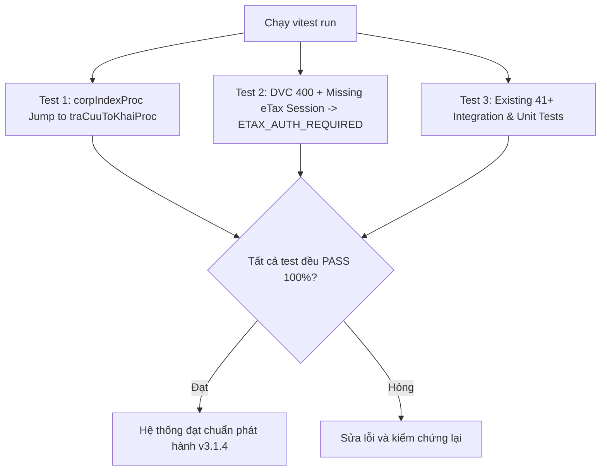

# Phase 5: Comprehensive Verification & Test Suite

## Overview

Xây dựng bộ kiểm thử tự động toàn diện để kiểm chứng 100% các sửa đổi từ Phase 1 đến Phase 4: Đảm bảo cơ chế ngắt và nhảy module `corpJumpProc` trong `LegacyFilingClient` triệt tiêu hoàn toàn lỗi `operation=unknown`, hợp đồng lỗi `ETAX_AUTH_REQUIRED` được tạo đúng khi DVC báo 400, và toàn bộ 41+ bài test hiện có của hệ thống vẫn vượt qua mà không có bất kỳ hồi quy nào.

## Requirements

- **Functional Requirements:**
  - **Kiểm thử Điều hướng SSO eTax (`LegacyFilingClient.test.ts` / `legacyFilingDownloaderAndWorkflow.test.ts`):**
    - Mô phỏng eTax SSO phản hồi HTML của trang chủ `corpIndexProc` (chứa `dse_operationName=corpIndexProc`, không có auto-submit form).
    - Xác nhận `followRedirectChain()` ngắt vòng lặp an toàn (`break`), không ném lỗi `Không xác định được bước điều hướng tiếp theo của eTax (operation=unknown)`.
    - Xác nhận `openLookupModule()` tự động gửi request `corpJumpProc -> traCuuToKhaiProc` và chuyển thành công sang màn hình tra cứu.
  - **Kiểm thử Chuẩn hóa Lỗi DVC-400 (`batchDownloadIntegration.test.ts`):**
    - Mô phỏng kịch bản DVC trả `validateIdTkhai = "400"`, không có attachment và `downloadhoso` trả về HTTP 500.
    - Mock fallback `resolveAndDownloadFiling` ném lỗi phiên làm việc chưa xác thực.
    - Xác nhận `DownloadManager` bắt lỗi và chuẩn hóa thành `item.filing.downloadErrorCode === 'ETAX_AUTH_REQUIRED'`.
    - Xác nhận thông báo lỗi không chứa chuỗi hex và nêu rõ hướng dẫn xác thực eTax.
  - **Kiểm thử Hồi quy Toàn diện:**
    - Chạy toàn bộ các test suite tải và tổ chức tệp:
      - `tests/legacyFilingDownloaderAndWorkflow.test.ts`
      - `tests/batchDownloadIntegration.test.ts`
      - `tests/fileOrganizer.test.ts`
      - `tests/legacyFilingResolveDownload.test.ts`
      - `tests/downloadPayload.test.ts`
    - Đảm bảo 100% các test case đều PASS.

- **Non-functional Requirements:**
  - Giữ thời gian chạy test suite nhanh (< 10 giây) nhờ mock hợp lý và fake timers.

## Architecture



## Related Code Files

- Modify: `tests/legacyFilingDownloaderAndWorkflow.test.ts`
- Modify: `tests/batchDownloadIntegration.test.ts`

## Implementation Steps

1. **Thêm Test Case kiểm chứng nhảy `corpIndexProc` trong `tests/legacyFilingDownloaderAndWorkflow.test.ts`:**
   ```ts
   it('13. followRedirectChain dừng an toàn khi gặp corpIndexProc và jump sang traCuuToKhaiProc', async () => {
     // Mock eTax SSO HTML chứa corpIndexProc
     // Gọi initializeEtaxSession / followRedirectChain
     // Xác nhận state cuối cùng là traCuuToKhaiProc và isEtaxInitialized = true
   });
   ```

2. **Thêm Test Case kiểm chứng hợp đồng `ETAX_AUTH_REQUIRED` trong `tests/batchDownloadIntegration.test.ts`:**
   ```ts
   it('15. DVC trả 400 và eTax thiếu phiên -> gán mã lỗi ETAX_AUTH_REQUIRED thân thiện', async () => {
     // Mock DVC validateIdTkhai = 400, attachments = []
     // Mock eTax ném AUTH_REQUIRED
     // Bắt đầu tải -> Xác nhận filing nhận downloadErrorCode = 'ETAX_AUTH_REQUIRED'
   });
   ```

3. **Chạy kiểm chứng tổng thể:**
   - Thực thi `npm test`.

## Success Criteria

- [x] Bài test nhảy `corpIndexProc` chạy thành công 100%.
- [x] Bài test chuẩn hóa mã lỗi `ETAX_AUTH_REQUIRED` chạy thành công 100%.
- [x] Toàn bộ test suite dự án không có lỗi hồi quy nào.

## Risk Assessment

- **Rủi ro:** Một số mock trong test cũ giả định `downloadError` phải chứa từ khóa DVC cũ.
  - *Tín hiệu:* Test assert chuỗi thông báo lỗi bị lệch.
  - *Biện pháp đối phó:* Cập nhật assertion để chấp nhận cả hai định dạng hoặc kiểm tra thông qua `code === 'ETAX_AUTH_REQUIRED'`.
