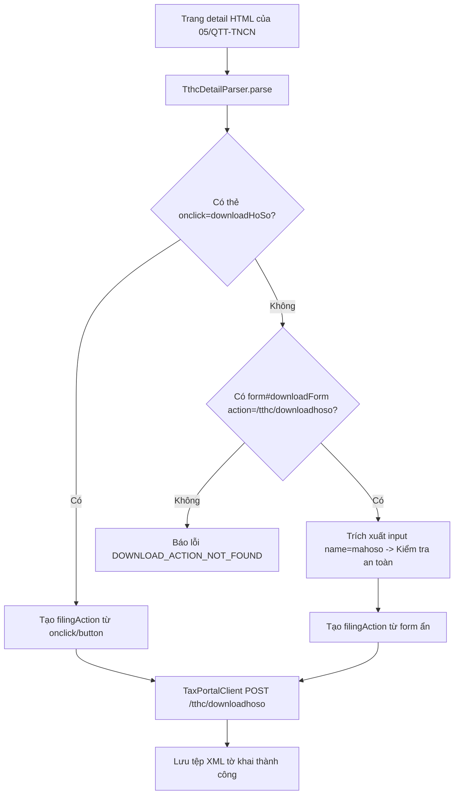

# Phase 1: Detail Form Parser & QTT Download Action Support

## Overview

Khắc phục triệt để lỗi không tải được tờ khai Quyết toán thuế TNCN (`05/QTT-TNCN`) và các tờ khai tương tự trên Cổng Dịch vụ công: Trang chi tiết hồ sơ DVC render tệp tải dưới dạng thẻ `<form id="downloadForm" action="/tthc/downloadhoso">` chứa `<input name="mahoso" ...>` thay vì thẻ `<a>` hoặc `<button>` có `onclick="downloadHoSo(this)"`. Parser `TthcDetailParser.ts` hiện tại bỏ qua thẻ form này dẫn đến lỗi `DOWNLOAD_ACTION_NOT_FOUND` và khiến quá trình tải báo lỗi HTTP 500.

## Requirements

- **Functional Requirements:**
  - Cập nhật `src/main/portal/TthcDetailParser.ts`:
    - Bổ sung bước phân tích các thẻ `<form>` trên trang chi tiết:
      - Quét tất cả thẻ `form` có `action` chứa `/downloadhoso` hoặc `id` chứa `downloadform` / `downloadForm`.
      - Trích xuất giá trị mã hồ sơ từ các input con: `input[name="mahoso"]`, `input[name="maHoSo"]`, `input[name="idTKhai"]`.
      - Trích xuất cờ `isThueDienTu` và `loaiTraCuu` nếu có trên form hoặc thuộc tính data.
    - Tạo `filingAction` hợp lệ dạng `{ kind: 'filing', maHoSo, isThueDienTu, loaiTraCuu }` nếu tìm thấy.
  - Cập nhật `src/main/portal/TaxPortalClient.ts`:
    - Đảm bảo `loadDeterministicDownloadContext()` và `downloadHoSoSingle()` nhận diện đúng action bắt nguồn từ form submit và gửi request POST `/tthc/downloadhoso` đúng tham số `mahoso`.

- **Non-functional Requirements:**
  - An toàn định danh: Kiểm tra tính an toàn của mã hồ sơ qua `isSafeIdentifier()` để chống chèn mã độc vào request.
  - Tương thích ngược: Giữ nguyên logic bóc tách thẻ có `onclick*="downloadHoSo"` cho các loại tờ khai DVC truyền thống khác.

## Architecture



## Related Code Files

- Modify: `src/main/portal/TthcDetailParser.ts`
- Modify: `src/main/portal/TaxPortalClient.ts`

## Implementation Steps

1. **Cập nhật `TthcDetailParser.ts`:**
   - Trong phương thức `parse(html: string, pageUrl: string)`:
     Sau vòng lặp duyệt các thẻ click `[onclick], [data-mahoso]...`:
     ```ts
     if (!filingAction) {
       $('form').each((_, el) => {
         const $form = $(el);
         const action = ($form.attr('action') || '').toLowerCase();
         const id = ($form.attr('id') || '').toLowerCase();
         if (action.includes('downloadhoso') || id.includes('downloadform')) {
           const rawMaHoSo =
             $form.find('input[name="mahoso"], input[name="maHoSo"], input[name="idTKhai"]').val() ||
             $form.find('[data-mahoso]').attr('data-mahoso') ||
             $form.attr('data-mahoso');
           const cleanMaHoSo = String(rawMaHoSo || '').trim();
           if (cleanMaHoSo && TthcDetailParser.isSafeIdentifier(cleanMaHoSo)) {
             const isTdt = TthcDetailParser.parseBooleanAttribute(
               $form.find('input[name="isThueDienTu"]').val() as string ||
               $form.attr('data-is-tdt')
             );
             const loai =
               ($form.find('input[name="loaiTraCuu"]').val() as string) ||
               $form.attr('data-loai-tra-cuu');
             filingAction = {
               kind: 'filing',
               maHoSo: cleanMaHoSo,
               isThueDienTu: isTdt,
               loaiTraCuu: loai
             };
           }
         }
       });
     }
     ```

2. **Cập nhật `TaxPortalClient.ts`:**
   - Trong `loadDeterministicDownloadContext()`, đảm bảo khi `action` đến từ form submit, URL tải và payload gửi lên server mang tham số `mahoso` hoặc `idTKhai` đúng như form quy định.

## Success Criteria

- [x] `TthcDetailParser.parse()` trích xuất thành công `filingAction` từ tệp mẫu `data/05qtt_detail.html` với `maHoSo = "000.701.18.G12-260331-27110000310611"`.
- [x] Chạy lệnh tải tờ khai `05/QTT-TNCN` (`000.701.18.G12-260331-27110000310611`) thành công, lấy về tệp XML/ZIP và không còn báo lỗi HTTP 500 hay `DOWNLOAD_ACTION_NOT_FOUND`.

## Risk Assessment

- **Rủi ro:** Một số form DVC dùng `POST` trực tiếp lên endpoint khác như `/tthc/downloadhoso-tdt`.
  - *Tín hiệu:* Action của form chứa `downloadhoso-tdt`.
  - *Biện pháp đối phó:* Kiểm tra `action.includes('downloadhoso')` (bao trùm cả hai trường hợp) và trích xuất đúng URL action đích.
