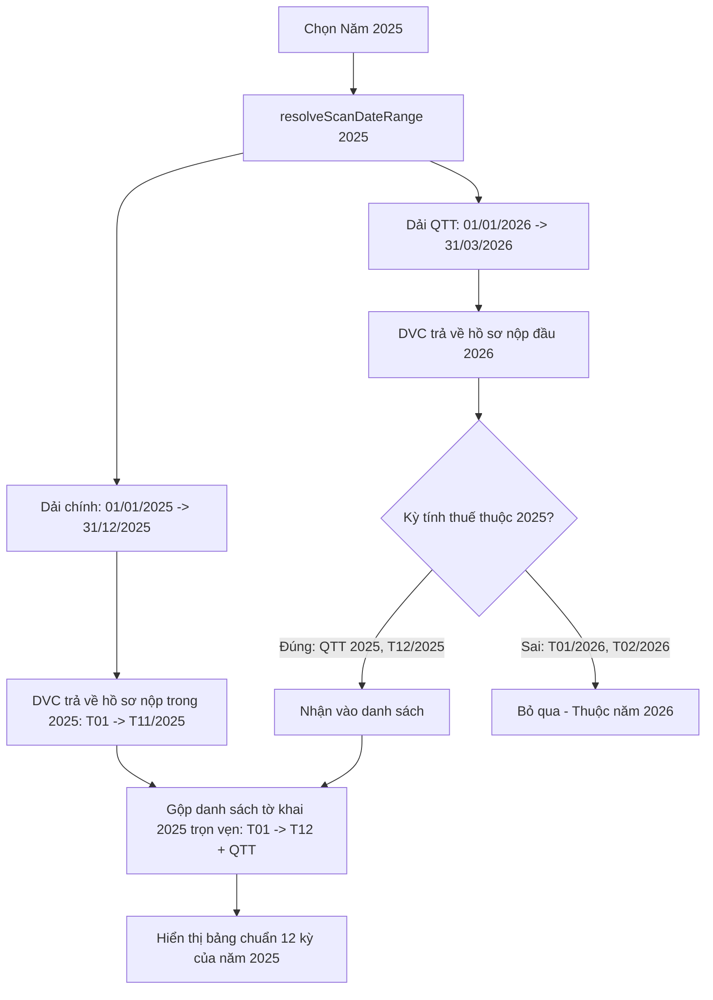

# Phase 2: Scan Date Range Isolation & Year Matching Logic

## Overview

Khắc phục triệt để lỗi phân dải dải ngày quét khiến người dùng quét năm 2025 lại ra các tờ khai Tháng 01, 02/2026 và bị thiếu mất các tờ khai từ Tháng 01 đến Tháng 05/2025. Tách biệt rõ ràng phạm vi ngày nộp thuộc năm tính thuế, truy vấn quyết toán riêng biệt có chọn lọc, và áp dụng bộ lọc kỳ tính thuế nghiêm ngặt trên bảng hiển thị `App.tsx`.

## Requirements

- **Functional Requirements:**
  - **Chuẩn hóa Dải ngày quét trong `src/shared/dateUtils.ts`:**
    - Phương thức `resolveScanDateRange(year, 'FULL_YEAR')`:
      - Dải ngày chính của năm $Y$: `fromDate: '01/01/' + year`, `toDate: '31/12/' + year`.
      - Ngăn chặn việc đẩy `toDate` sang ngày `31/03/(Y+1)` trong request chính, vì việc này làm server DVC sắp xếp các tờ khai nộp đầu năm sau lên đầu và đẩy các tờ khai đầu năm $Y$ (Tháng 1 đến Tháng 5) ra khỏi giới hạn phân trang.
  - **Truy vấn Quyết toán & Tháng 12 năm sau trong `TaxScanEngine.ts`:**
    - Với năm cũ ($Y < \text{currentYear}$), engine thực hiện một sub-query bổ sung từ `01/01/(Y+1)` đến `31/03/(Y+1)`.
    - Lọc nghiêm ngặt: Chỉ nhận các tờ khai có kỳ thuộc năm $Y$ (ví dụ: QTT TNCN năm $Y$, QTT TNDN năm $Y$, hoặc GTGT Tháng 12/$Y$).
    - Loại bỏ ngay các tờ khai thuộc kỳ năm $Y+1$ (như Tháng 01, 02/$Y+1$) để không làm nhiễm bẩn bảng kết quả của năm $Y$.
  - **Lọc hiển thị theo Kỳ tính thuế trong `src/renderer/App.tsx`:**
    - Khi người dùng chọn xem một năm cụ thể (`selectedYear`, không phải chế độ đa năm):
      - Bảng `InventoryTable` chỉ hiển thị các hồ sơ có kỳ tính thuế khớp với `selectedYear` (`f.periodNormalized?.year === selectedYear`).
      - Ngăn chặn việc một tờ khai nộp vào đầu năm sau bị hiển thị lộn xộn trong danh sách năm trước.

- **Non-functional Requirements:**
  - Đảm bảo tính toán đầy đủ cảnh báo thiếu kỳ (`checkMissingPeriods`) cho đúng 12 tháng hoặc 4 quý của năm được chọn.

## Architecture



## Related Code Files

- Modify: `src/shared/dateUtils.ts`
- Modify: `src/main/scanner/TaxScanEngine.ts`
- Modify: `src/renderer/App.tsx`

## Implementation Steps

1. **Cập nhật `src/shared/dateUtils.ts`:**
   ```ts
   if (mode === 'FULL_YEAR') {
     return {
       fromDate: `01/01/${year}`,
       toDate: year === currentYear ? todayStr : `31/12/${year}`,
       label: `Cả năm ${year}`,
       level: 'YEAR'
     };
   }
   ```

2. **Cập nhật `src/main/scanner/TaxScanEngine.ts`:**
   - Trong vòng lặp quét bổ sung cho năm cũ (dòng 238–251):
     Sau khi query dải ngày nộp `01/01/(Y+1)` đến `31/03/(Y+1)`:
     Lọc kết quả chỉ giữ lại hồ sơ có `f.periodNormalized?.year === y` hoặc tiêu đề/kỳ chứa năm $y$.

3. **Cập nhật `src/renderer/App.tsx`:**
   - Định nghĩa `displayedFilings`:
     ```ts
     const displayedFilings = useMemo(() => {
       if (scanRangeMode.startsWith('MULTI')) return filings;
       return filings.filter(f => {
         const y = f.periodNormalized?.year;
         return !y || y === selectedYear;
       });
     }, [filings, selectedYear, scanRangeMode]);
     ```
   - Truyền `displayedFilings` vào `InventoryTable`.

## Success Criteria

- [x] Khi quét năm 2025, danh sách kết quả chứa đầy đủ các kỳ từ Tháng 01/2025 đến Tháng 12/2025.
- [x] Không còn tờ khai Tháng 01/2026 hay Tháng 02/2026 xuất hiện trong chế độ xem năm 2025.
- [x] Cảnh báo thiếu kỳ kiểm tra đúng 12 tháng của năm 2025.

## Risk Assessment

- **Rủi ro:** Một doanh nghiệp nộp tờ khai Tháng 11 vào ngày 05/01 năm sau (nộp muộn).
  - *Tín hiệu:* Tờ khai nộp muộn nằm ở dải ngày nộp năm sau.
  - *Biện pháp đối phó:* Dải query bổ sung `01/01/(Y+1)` đến `31/03/(Y+1)` sẽ bắt được tờ khai này và bộ lọc kỳ sẽ giữ lại tờ khai vì kỳ tính thuế vẫn là Tháng 11/Y.
