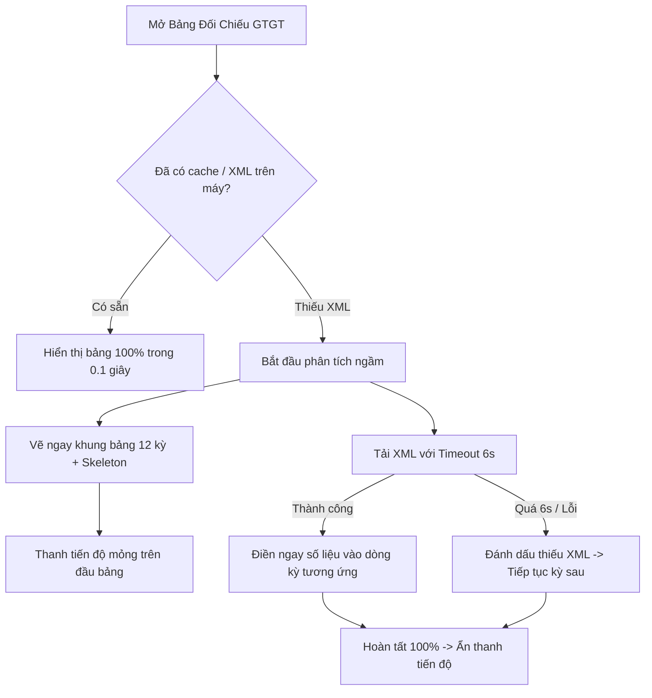

# Phase 3: VAT Reconciliation Non-Blocking Progressive Render

## Overview

Loại bỏ hoàn toàn hiện tượng "treo trắng bảng đối chiếu thuế GTGT" khi người dùng mở Drawer soát xét: Giảm thời gian chờ tải tệp trực tuyến khi phân tích (fail-fast timeout 6 giây thay vì 45 giây), và kết xuất cấu trúc bảng working paper 12 kỳ lũy tiến ngay lập tức (Progressive Loading), hiển thị số liệu các kỳ đã có sẵn thay vì che toàn bộ màn hình bằng khoảng trắng.

## Requirements

- **Functional Requirements:**
  - **Giảm Timeout Tải ngầm trong `VatAnalyticsEngine.ts`:**
    - Khi phân tích mà gặp tờ khai chưa có tệp XML trên máy:
      - Giới hạn thời gian chờ tải trực tuyến tối đa 6.000ms cho mỗi hồ sơ (`timeout: 6000`).
      - Nếu sau 6 giây không lấy được file (do mạng chậm, eTax đứt phiên hoặc DVC lỗi):
        - Đánh dấu ngay `snapshot.xmlAvailable = false`.
        - Ghi nhận vào danh sách `failedXmlDetails`.
        - Lập tức chuyển sang phân tích kỳ tiếp theo, không để tiến trình bị đứng lại ở `8/14 tờ khai...`.
  - **Kết xuất Bảng Lũy Tiến trong `src/renderer/components/VatReferenceDrawer.tsx`:**
    - Thay thế điều kiện render nhị phân `isLoading ? <Spinner /> : <Table />`.
    - Khi `isLoading === true`:
      - Vẫn kết xuất bảng 12 kỳ bình thường.
      - Hiển thị thanh tiến trình (progress bar) và thông điệp tiến độ dạng thanh thông báo mỏng ở cạnh trên của bảng:
        `Đang phân tích dữ liệu: 8/14 tờ khai...`
      - Các ô dữ liệu của kỳ đang phân tích hiển thị hiệu ứng skeleton mờ nhẹ; các kỳ đã có dữ liệu hiển thị ngay số tiền Doanh thu [34], Thuế đầu ra [35], Khấu trừ [43]...
      - Giúp kế toán quan sát được dữ liệu ngay lập tức mà không phải nhìn vào màn hình trắng.

- **Non-functional Requirements:**
  - Tối ưu hiệu năng: Không gây giật lag khi cập nhật state lũy tiến cho bảng.

## Architecture



## Related Code Files

- Modify: `src/main/scanner/VatAnalyticsEngine.ts`
- Modify: `src/renderer/components/VatReferenceDrawer.tsx`

## Implementation Steps

1. **Cập nhật timeout trong `VatAnalyticsEngine.ts`:**
   - Trong `downloadHoSoWithRetry`:
     Đặt timeout cho request tải XML ngầm là `6000ms`.
     Bắt nhanh lỗi và không thử lại quá 1 lần đối với chế độ phân tích nhanh.

2. **Cải tiến `VatReferenceDrawer.tsx`:**
   - Tại vị trí render bảng (dòng 556–562):
     Không ẩn toàn bộ bảng khi `isLoading === true`.
     Luôn render thẻ `<table ...>` và kết xuất 12 dòng kỳ của năm.
     Đặt thanh thông báo loading ở trên đầu bảng dạng banner nhẹ:
     ```tsx
     {isLoading && (
       <div className="bg-teal-50 border-b border-teal-200 px-4 py-1.5 flex items-center justify-between text-xs text-teal-800 animate-pulse">
         <span className="flex items-center space-x-2">
           <RefreshCw className="w-3.5 h-3.5 animate-spin text-teal-700" />
           <span>{progressMessage || 'Đang bóc tách số liệu tờ khai...'}</span>
         </span>
         <span className="text-[11px] font-mono text-teal-600">Đang cập nhật...</span>
       </div>
     )}
     ```

## Success Criteria

- [x] Khi mở Bảng đối chiếu GTGT, bảng 12 tháng hiển thị ngay lập tức, không còn khoảng trắng lớn ở giữa màn hình.
- [x] Thời gian phân tích nhanh không bao giờ vượt quá 10 giây dù có hồ sơ bị lỗi mạng.
- [x] Số liệu của các kỳ có sẵn file XML hiển thị đầy đủ và chính xác.

## Risk Assessment

- **Rủi ro:** Khi dữ liệu đang tải dở, người dùng nhấp vào một con số để xem chứng cứ.
  - *Tín hiệu:* Dữ liệu của kỳ đó chưa hoàn tất.
  - *Biện pháp đối phó:* Inspector hiển thị trạng thái "Đang cập nhật chứng cứ cho kỳ này" nếu snapshot chưa có cờ `xmlAvailable`.
