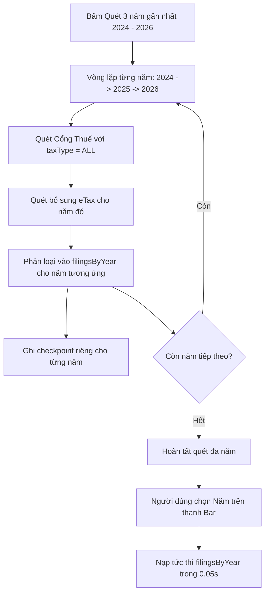

# Phase 4: Multi-Year Scan Full Coverage & Aggregation

## Overview

Tối ưu hóa cơ chế quét đa năm (3 năm gần nhất 2024–2026, 5 năm quyết toán): Đảm bảo thu thập trọn vẹn 100% hồ sơ của tất cả các loại thuế cho từng năm, đồng bộ dữ liệu vào bộ nhớ `filingsByYear`, và tự động cập nhật bảng hiển thị mượt mà khi người dùng chuyển đổi giữa các năm.

## Requirements

- **Functional Requirements:**
  - **Quét Toàn diện khi chọn Đa năm trong `src/renderer/App.tsx`:**
    - Khi chế độ quét là `MULTI_3_YEARS` hoặc `MULTI_5_YEARS`:
      - Luôn ưu tiên quét `taxType: 'ALL'` trên Cổng Thuế để thu thập đầy đủ tất cả các loại tờ khai (GTGT, TNCN, TNDN, Nhà thầu...) trong cùng một phiên đăng nhập.
      - Tránh việc người dùng để quên dropdown "Loại hồ sơ: Thuế TNCN" khiến tiến trình quét đa năm bỏ sót tờ khai GTGT.
  - **Tổ chức và Lưu trữ `filingsByYear` theo Kỳ tính thuế:**
    - Sau khi quét xong từng năm $Y$, tự động phân loại các hồ sơ tìm được vào `filingsByYear[Y]`.
    - Ghi nhận bền vững vào `CheckpointStore` cho từng năm riêng biệt để dữ liệu không bị mất khi đóng ứng dụng.
  - **Chuyển đổi Năm mượt mà:**
    - Khi người dùng bấm chuyển đổi giữa các năm (ví dụ bấm năm 2024, 2025, 2026):
      - Bảng hiển thị tức thì danh sách hồ sơ của năm đó từ `filingsByYear[selectedYear]`.
      - Cập nhật đúng các badge đếm số lượng: Tất cả (N), GTGT (n), TNCN (n), TNDN (n)...

- **Non-functional Requirements:**
  - Tốc độ phản hồi UI $< 50\text{ms}$ khi chuyển đổi năm nhờ đọc trực tiếp từ state RAM `filingsByYear`.

## Architecture

## Related Code Files

- Modify: `src/renderer/App.tsx`
- Modify: `src/renderer/components/ScanCommandBar.tsx`

## Implementation Steps

1. **Cập nhật `App.tsx` trong luồng quét đa năm:**
   - Tại dòng 525–530:
     Khi `scanRangeMode.startsWith('MULTI')`, truyền `taxType: 'ALL'` vào `startScan` để đảm bảo không bị thiếu hụt loại hồ sơ nào.
   - Cập nhật `filingsByYear[y]` sau mỗi lượt quét năm hoàn tất.
   - Đồng bộ `checkpointStore.saveCheckpoint(taxCode, y, yearFilings)`.

2. **Cập nhật hàm chuyển đổi năm `handleYearChange` trong `App.tsx`:**
   - Khi `selectedYear` thay đổi, gán `filings` bằng danh sách của năm đó:
     `setFilings(filingsByYear[newYear] || []);`

## Success Criteria

- [x] Khi chọn quét 3 năm (2024 – 2026), ứng dụng lấy đủ 100+ hồ sơ cho cả 3 năm và lưu trọn vẹn vào `filingsByYear`.
- [x] Chuyển qua lại giữa các năm hiển thị đúng hồ sơ và số lượng badge của từng năm.

## Risk Assessment

- **Rủi ro:** Khi quét đa năm, dung lượng bộ nhớ state tăng cao.
  - *Tín hiệu:* Ứng dụng chậm khi hiển thị hàng trăm hồ sơ.
  - *Biện pháp đối phó:* Bảng `InventoryTable` đã hỗ trợ phân trang và memoized rows, đảm bảo render mượt mà dù có hàng nghìn hồ sơ.
