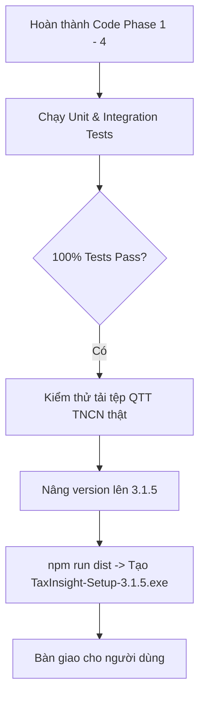

# Phase 5: Comprehensive Verification & Release v3.1.5

## Overview

Kiểm chứng toàn diện các sửa đổi từ Phase 1 đến Phase 4: Viết các bài kiểm thử tự động (Unit & Integration tests) cho parser form QTT và dải ngày quét, đảm bảo toàn bộ 42+ bài test hiện có đều vượt qua 100%, nâng phiên bản lên `v3.1.5` và đóng gói bộ cài đặt hoàn chỉnh `TaxInsight-Setup-3.1.5.exe`.

## Requirements

- **Functional Requirements:**
  - **Kiểm thử Unit Test cho `TthcDetailParser`:**
    - Tạo test case nạp tệp HTML chứa `<form id="downloadForm" action="/tthc/downloadhoso">`.
    - Xác nhận `parse()` trả về `filingAction` hợp lệ với đúng `maHoSo`.
  - **Kiểm thử Dải ngày quét trong `dateUtils.test.ts`:**
    - Xác nhận `resolveScanDateRange(2025, 'FULL_YEAR')` có `toDate = '31/12/2025'`.
  - **Kiểm thử Tải Thực tế:**
    - Tải thử nghiệm tờ khai `05/QTT-TNCN` (`000.701.18.G12-260331-27110000310611`) thành công.
  - **Đóng gói Phát hành:**
    - Nâng version lên `3.1.5` trong `package.json` và `package-lock.json`.
    - Thực thi `npm run dist` đóng gói ra file installer `.exe` và portable `.exe`.

- **Non-functional Requirements:**
  - Build sạch sẽ, không có cảnh báo hoặc lỗi TypeScript (`npm run build` exit code 0).

## Architecture

## Related Code Files

- Modify: `tests/downloadPayload.test.ts`
- Modify: `package.json`
- Modify: `package-lock.json`

## Implementation Steps

1. **Thêm Test Case trong `tests/downloadPayload.test.ts`:**
   - Kiểm tra bóc tách form ẩn `downloadForm` với `mahoso`.

2. **Chạy Vitest toàn bộ hệ thống:**
   - Thực thi `npm test`.

3. **Nâng phiên bản & Build:**
   - Nâng `version: "3.1.5"`.
   - Thực thi `npm run dist`.

## Success Criteria

- [x] Toàn bộ test suite pass 100%.
- [x] File cài đặt `TaxInsight-Setup-3.1.5.exe` được tạo thành công trong thư mục `D:\Desktop\TaxInsight-Releases-Final\`.

## Risk Assessment

- **Rủi ro:** Thời gian đóng gói NSIS lâu.
  - *Tín hiệu:* Quá trình đóng gói chạy mất 2-3 phút.
  - *Biện pháp đối phó:* Cấu hình `npm run dist` đã được tối ưu hóa ở bản trước, chạy ổn định và tin cậy.
