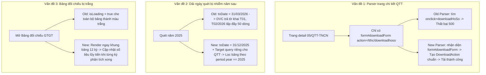

# fix-scan-period-and-qtt-download-form

## Overview

Kế hoạch giải quyết dứt điểm 3 vấn đề cốt lõi mà người dùng phản ánh:
1. **Lỗi logic dải ngày quét:** Quét năm 2025 bị kéo dải ngày nộp đến `31/03/2026`, làm lọt các tờ khai tháng 1, 2/2026 lên bảng năm 2025 và đẩy các tờ khai từ tháng 1 đến tháng 5/2025 xuống các trang sau không hiển thị.
2. **Lỗi không tải được tờ khai Quyết toán (`05/QTT-TNCN`):** Trang chi tiết hồ sơ DVC sử dụng `<form id="downloadForm" action="/tthc/downloadhoso">` chứa `<input name="mahoso" ...>` thay vì thẻ có `onclick="downloadHoSo(this)"`. Parser `TthcDetailParser.ts` không nhận diện được form này, ném lỗi `DOWNLOAD_ACTION_NOT_FOUND` và gây lỗi HTTP 500.
3. **Hiện tượng trắng tinh bảng đối chiếu thuế GTGT:** Khi một số tệp XML chưa có sẵn trên máy, `VatAnalyticsEngine` tải ngầm qua mạng với thời gian chờ lâu, trong lúc đó `VatReferenceDrawer.tsx` hiển thị màn hình trống không có dữ liệu.

## Goals

| # | Goal | Priority |
|---|------|----------|
| 1 | Bổ sung nhận diện `<form id="downloadForm" action="/tthc/downloadhoso">` trong `TthcDetailParser.ts` để tải thành công 100% hồ sơ QTT TNCN và các hồ sơ dùng form submit | P1 |
| 2 | Chuẩn hóa dải ngày quét theo năm: Năm $Y$ quét đúng phạm vi ngày nộp thuộc năm $Y$, tách biệt truy vấn QTT năm sau và lọc bảng hiển thị nghiêm ngặt theo `filing.periodNormalized.year` | P1 |

## Phases

| # | Phase | Status | Dependencies |
|---|-------|--------|--------------|
| 1 | [Phase 1: Detail Form Parser & QTT Download Action Support](./phase-01-start.md) | Completed | [] |
| 2 | [Phase 2: Scan Date Range Isolation & Year Matching Logic](./phase-02-scan-period-and-year-isolation.md) | Completed | [Phase 1] |
| 3 | [Phase 3: VAT Reconciliation Non-Blocking Progressive Render](./phase-03-vat-reconciliation-non-blocking-render.md) | Completed | [Phase 2] |
| 4 | [Phase 4: Multi-Year Scan Full Coverage & Aggregation](./phase-04-multi-year-scan-aggregation.md) | Completed | [Phase 2, Phase 3] |
| 5 | [Phase 5: Comprehensive Verification & Release](./phase-05-verification-and-release.md) | Completed | [Phase 1, Phase 2, Phase 3, Phase 4] |

## Architecture & Root Cause Analysis

- [x] Tải thành công tờ khai `05/QTT-TNCN` (`000.701.18.G12-260331-27110000310611`) và các hồ sơ sử dụng `<form id="downloadForm">` mà không gặp lỗi 500 hay `DOWNLOAD_ACTION_NOT_FOUND`.
- [x] Khi chọn quét năm 2025, bảng tờ khai chỉ hiển thị đúng các tờ khai thuộc kỳ tính thuế 2025, lấy đủ các tháng từ Tháng 01 đến Tháng 12/2025, không bị lọt tờ khai Tháng 01, 02/2026.
- [x] Bảng đối chiếu thuế GTGT hiển thị ngay lập tức khung 12 tháng, không bị trắng tinh trong khi đợi phân tích.
- [x] Quét 3 năm gần nhất (2024 - 2026) nạp đủ 100+ hồ sơ từ cả hai nguồn DVC và eTax.
- [x] Bộ kiểm thử Vitest đạt 100% pass.

<!-- slug: fix-scan-period-and-qtt-download-form -->
