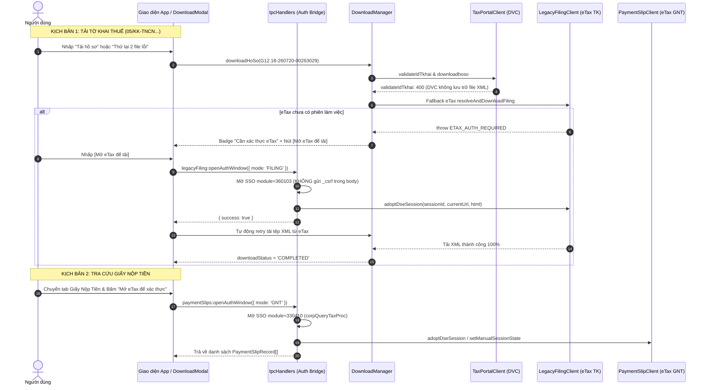

# fix-etax-dvc-linkage-download-and-analytics

## Overview

Kế hoạch nâng cấp và sửa chữa toàn diện hệ thống kết nối liên thông Cổng Dịch vụ công (DVC - `dichvucong.gdt.gov.vn`) và Cổng Thuế Điện Tử (eTax - `thuedientu.gdt.gov.vn`), tháo gỡ điểm nghẽn tải tệp và phân tích dữ liệu:

1. **Phân định rạch ròi luồng xác thực eTax Tờ khai và Giấy nộp tiền:** Tách riêng cửa sổ xác thực tương tác `openEtaxAuthWindow(mode: 'FILING' | 'GNT')`. Triệt tiêu hoàn toàn tình trạng nhấp "Mở eTax để tải tờ khai" lại bị nhảy sang phân hệ "Tra cứu Giấy Nộp Tiền".
2. **Khắc phục lỗi không tải được tờ khai thuế:** Sửa lỗi Cổng DVC báo mã `400` / `500` cho các tờ khai nộp qua kênh eTax (`05/KK-TNCN`, `01/GTGT`...); hoàn thiện cơ chế nạp DSE session, URL, HTML và bảng danh mục form `availableFormOptions` trong `LegacyFilingClient`.
3. **Khắc phục lỗi không tải được Giấy nộp tiền:** Loại bỏ tham số `_csrf` ở body trong request SSO gây lỗi Spring Security 403 Forbidden; xử lý chuyển tiếp tự động từ trang chủ eTax (`corpIndexProc`) sang form tra cứu GNT (`corpQueryTaxProc`).
4. **Cơ chế chịu lỗi phân tích linh hoạt (Graceful Analytics Degradation):** Bọc xử lý an toàn tại từng kỳ kê khai trong `VatAnalyticsEngine` và `PitAnalyticsEngine`. Khi thiếu tệp XML của một vài kỳ, hệ thống ghi nhận `xmlAvailable: false` và hoàn thành bảng đối chiếu với các kỳ còn lại, không để xảy ra lỗi sập toàn bộ Working Paper.

---

## Goals & Phases

| # | Phase | Mục tiêu | Độ ưu tiên | Trạng thái |
|---|-------|----------|------------|------------|
| 1 | [Phase 1: Phân tách Cửa sổ Xác thực eTax Tờ khai & GNT](./phase-01-auth-window-mode-separation.md) | Tách biệt luồng SSO Module 360103 (Tờ khai) và Module 330410 (GNT), sửa 403 CSRF body và auto-jump eTax | P1 | Completed |
| 2 | [Phase 2: Hoàn thiện Fallback eTax & Tải Tờ khai Thuế](./phase-02-legacy-filing-and-dvc-fallback.md) | Đồng bộ đầy đủ DSE State, HTML form options trong `LegacyFilingClient`, khớp chính xác tờ khai 05/KK, 01/GTGT | P1 | Completed |
| 3 | [Phase 3: Chuẩn hóa Tra cứu & Tải Giấy Nộp Tiền](./phase-03-gnt-sso-and-auto-navigation.md) | Sửa thứ tự module SSO trong `PaymentSlipClient`, đảm bảo quét và trích xuất bảng kê C1-02/NS tự động | P1 | Completed |
| 4 | [Phase 4: Graceful Degradation cho Động cơ Phân tích](./phase-04-analytics-graceful-degradation.md) | Chống crash toàn trang trong `VatAnalyticsEngine` và `PitAnalyticsEngine` khi thiếu file XML | P2 | Completed |
| 5 | [Phase 5: Kiểm thử Toàn diện & Xác minh Thực tế](./phase-05-comprehensive-verification-and-tests.md) | Bổ sung unit/integration tests cho các kịch bản lỗi, đảm bảo 100% test suites hiện hành pass | P1 | Completed |
---

## Architecture & Interaction Flow

---

## Success Criteria

- [x] Khi nhấp `[Mở eTax để tải]` trên tờ khai `05/KK-TNCN`, cửa sổ mở đúng tiêu đề và module Tra cứu tờ khai thuế (`360103`), không còn hiển thị thông báo Giấy nộp tiền.
- [x] Không còn lỗi 403 Forbidden khi thực hiện SSO từ Cổng DVC sang eTax.
- [x] Tờ khai nộp qua kênh eTax (DVC trả 400) được tự động chuyển tiếp và tải thành công file XML gốc về máy.
- [x] Tra cứu Giấy nộp tiền không bị kẹt tại trang chủ eTax `corpIndexProc`, tự động trích xuất bảng chứng từ C1-02/NS.
- [x] Phân hệ Phân tích GTGT và TNCN hoạt động bền bỉ: nếu một kỳ chưa có XML tải về thì hiển thị cảnh báo thiếu file kỳ đó, các kỳ còn lại vẫn được phân tích đầy đủ, không làm sập Working Paper.
- [x] Toàn bộ 61 test suites trong dự án chạy pass 100%, không có bất kỳ hồi quy nào.
